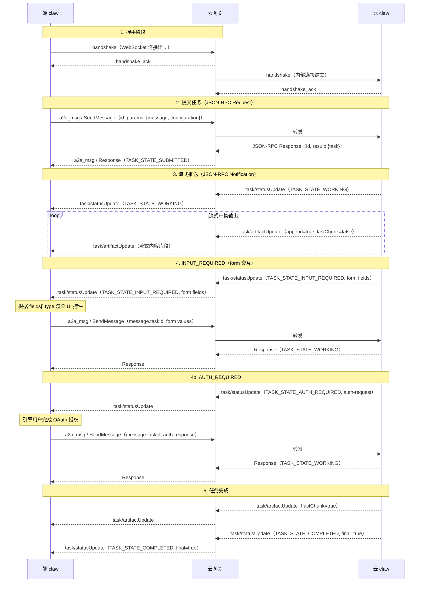

        { "text": "这就是春天带给我们的美好与希望。" }
      ]
    },
    "append": true,
    "lastChunk": true
  }
}
```

**task/artifactUpdate params 字段说明：**

| 字段 | 类型 | 必须 | 说明 |
| --- | --- | --- | --- |
| taskId | string | 是 | 所属任务 ID |
| contextId | string | 是 | 对话上下文 ID |
| artifact | Artifact | 是 | 产物内容，结构见 4.2 节 |
| append | boolean | 是 | `true`=增量追加到同 artifactId 的产物；`false`=替换 |
| lastChunk | boolean | 是 | `true`=该产物流式传输结束 |

---

## 六、交互时序



---

## 七、错误处理

所有错误统一使用 JSON-RPC 2.0 Error 格式。

### 7.1 错误响应格式

```json
{
  "jsonrpc": "2.0",
  "id": "req-001",
  "error": {
    "code": -32001,
    "message": "Task not found",
    "data": {
      "taskId": "task-nonexistent-xxx"
    }
  }
}
```

对于非关联特定请求的全局错误（如网关连接断开），`id` 为 `null`：

```json
{
  "jsonrpc": "2.0",
  "id": null,
  "error": {
    "code": 250001,
    "message": "服务器出小差了，请稍后重试~",
    "data": {
      "detail": "console disconnected"
    }
  }
}
```

### 7.2 错误码定义

**A2A 标准错误码（对齐官方规范）：**

| code | 名称 | 说明 |
| --- | --- | --- |
| -32001 | TaskNotFoundError | 任务不存在 |
| -32002 | TaskNotCancelableError | 任务不可取消（已是终态） |
| -32003 | PushNotificationNotSupportedError | 不支持推送通知 |
| -32004 | UnsupportedOperationError | 不支持的操作（如向终态任务发消息） |
| -32005 | ContentTypeNotSupportedError | 不支持的内容类型 |
| -32006 | InvalidAgentResponseError | Agent 返回无效响应 |
| -32007 | ExtendedAgentCardNotConfiguredError | 扩展 AgentCard 未配置 |
| -32008 | ExtensionSupportRequiredError | 需要扩展支持 |
| -32009 | VersionNotSupportedError | 不支持的协议版本 |
| -32700 | ParseError | JSON 解析失败 |
| -32600 | InvalidRequest | 无效的 JSON-RPC 请求 |
| -32601 | MethodNotFound | 方法不存在 |
| -32602 | InvalidParams | 参数无效 |
| -32603 | InternalError | 服务端内部错误 |
| 以下业务定制错误 |  |  |
| -40000 |  |  |
|  |  |  |
|  |  |  |
|  |  |  |

**网关层自定义错误码：**

| code | 说明 |
| --- | --- |
| 250000 | 请求参数无效 |
| 250001 | console 连接断开 |
| 250002 | 数据包解码失败 |
| 250003 | package_id 缺失 |
| 250004 | handshake payload 缺失 |
| 250005 | handshake_type 错误 |
| 250006 | resume session_id 无效 |
| 250007 | 未知数据类型 |
| 250008-250012 | 内部超时/信号错误 |

### 7.3 错误示例

**TaskNotFound（请求不存在的任务）：**

```json
{
  "jsonrpc": "2.0",
  "id": "req-003",
  "error": {
    "code": -32001,
    "message": "Task not found",
    "data": {
      "taskId": "task-nonexistent-xxx"
    }
  }
}
```

**UnsupportedOperation（向终态任务发消息）：**

```json
{
  "jsonrpc": "2.0",
  "id": "req-005",
  "error": {
    "code": -32004,
    "message": "Cannot send message to a completed task",
    "data": {
      "taskId": "task-363422be-b0f9-4692-a24d-278670e7c7f1",
      "currentState": "TASK_STATE_COMPLETED"
    }
  }
}
```

**网关连接断开（全局错误，id=null）：**

```json
{
  "jsonrpc": "2.0",
  "id": null,
  "error": {
    "code": 250001,
    "message": "服务器出小差了，请稍后重试~",
    "data": {
      "detail": "console disconnected"
    }
  }
}
```

---

## 八、超时与重试

### 8.1 超时参数

| 场景 | 默认超时 | 说明 |
| --- | --- | --- |
| handshake 完成 | 10s | 客户端发送 handshake 后等待 handshake_ack |
| SendMessage 响应 | 30s | 从发送请求到收到 JSON-RPC Response |
| 任务总超时 | 120s | 从发送 SendMessage 到收到 final=true 的 task/statusUpdate |
| 首帧推送 | 30s | 从收到 Response 到收到第一个 Notification |
| GetTask / CancelTask | 10s | 管理类请求 |

### 8.2 心跳保活

- WebSocket 层使用 Ping/Pong 帧，间隔 30s
- 连续 2 次 Pong 超时视为连接断开
- 网关断开连接时推送全局错误（code: 250001, id: null）
### 8.3 重试策略

- 客户端发送失败（WebSocket 未就绪）：本地排队，连接恢复后重发
- handshake 超时：客户端重新建连
- task 超时：客户端可通过 `GetTask` 查询状态，决定是否重发
- 网关不做自动重试，所有重试逻辑由客户端决策

---

# 3、记忆协议

websocket url参数 biz_code=memory

## ~~3.1 记忆反查http协议 （记忆服务端调用）~~

**新协议见下面3.1.2**

域名：

预发环境机房：      [blueclaw-infra-pre.vmic.xyz](http://blueclaw-infra-pre.vmic.xyz)

预发环境办公网：   [blueclaw-infra-pre.vivo](http://blueclaw-infra-pre.vivo).lan:8080

http url : [blueclaw-infra-pre.vivo](http://blueclaw-infra-pre.vivo).lan:8080/device/proxy

content-type: application/json

### http请求payload(结构化filter检索)

```json
{
    "msgType": "cloud2client",
    "version": "1.0",
    "packageName": "com.vivo.ai.copilot",
    "timestamp": 1778157212883,
    "sessionId": "ccf5bbb2-89c9-4cd3-b9c7-7e22e80ec0a7",
    "traceId": "d49e1bfd43f64acd8de7b684be762a0e",
    "userId" : "dsfsfdsfsfsdfsd",
    "vaid": "seed-user-alice",
    "body": {
        "method": "queryMemory",
        "bizName": "BlueClaw",
        "params": {
          "paramList":[
            {
                "memoryType": "episodic",
                "strategy": "filter",
                "isEntityRelated": true,
                "limit": 50,
                "filter": {
                    "memory": [
                        {
                            "labelTree": "购物",
                            "field": "String"
                        },
                        {
                            "createdAtStart": 1762963201314,
                            "field": "Long",
                            "opStart": "gt",
                            "createdAtEnd": 1862963201314,
                            "opEnd": "lt"
                        },
                        {
                            "updatedAtStart": 1762963201314,
                            "field": "Long",
                            "opStart": "ge",
                            "updatedAtEnd": 1862963201314,
                            "opEnd": "le"
                        }
                    ],
                    "entity": [
                        {
                            "entityType": "commute_time",
                            "field": "Long",
                            "opStart": "ge",
                            "startTime": 1762963201314,
                            "opEnd": "le",
                            "endTime": 1892963201314
                        },
                        {
                            "entityType": "commute_action",
                            "field": "String",
                            "entityText": "进入"
                        },
                        {
                            "entityType": "commute_time",
                            "field": "String",
                            "entityText": "上班时间"
                        }
                    ]
                }
            }
          ]     
        }
    }
    
}
```

### http请求payload(向量verctor检索, 和filter分开请求)

```json
{
    "msgType": "cloud2client",
    "version": "1.0",
    "packageName": "com.vivo.ai.copilot",
    "timestamp": 1778157212883,
    "sessionId": "ccf5bbb2-89c9-4cd3-b9c7-7e22e80ec0a7",
    "traceId": "d49e1bfd43f64acd8de7b684be762a0e",
    "userId" : "dsfsfdsfsfsdfsd",
    "vaid": "seed-user-alice",
    "body": {
        "method": "queryMemory",
        "bizName": "BlueClaw",
        "params": {
          "paramList":[
            {
                "memoryType": "episodic",
                "strategy": "vector",
                "isEntityRelated": true,
                "vector": {
                  "topK": 10,
                  "query": "昨天我跟谁一起开会来着",
                  "queryField": "summary",
                  "minSimilarity": 0.8
                }
            }
          ]     
        }
    }
    
}
```

### websocket请求

msg_type="cloud2client"
