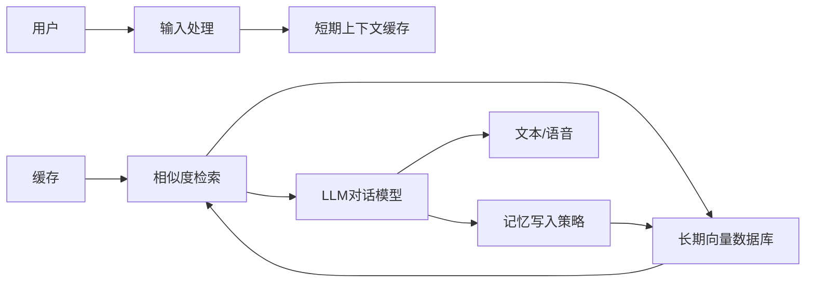
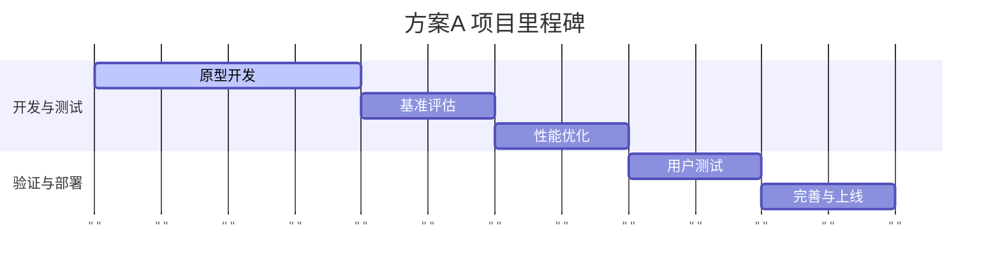
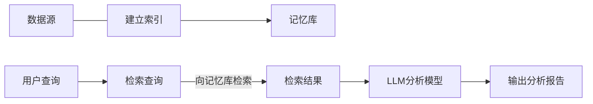
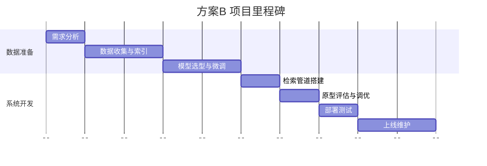

## **~~思考方案~~**

# **~~方案A：面向闲聊场景的记忆方案~~**

## **~~系统架构~~**

~~设计一个低延时的检索增强对话系统。用户输入后，首先在本地~~**~~短期缓存~~**~~（500-1000 tokens）中检索最近上下文，再访问一个向量化的~~**~~长期记忆库~~**~~（类似LoCoMo的对话记忆）。将检索结果与当前对话历史拼接为模型输入，并由在线部署的高效模型（如 Kimi 线性或 Qwen Omni 等）生成回答。回答后，系统根据策略（关键词触发或关键事件）~~**~~增量更新记忆库~~**~~。整体流程示意如下：~~



## **~~延时预算~~**

  1. **~~用户输入预处理~~**~~：<100ms（本地）。~~
  2. **~~相似度检索~~**~~：针对数千条记忆，利用 ANN 索引或向量数据库（如 FAISS）在 <200ms 内返回 Top-k 文档。~~
  3. **~~模型推理~~**~~：使用轻量高效的模型（如改进的轻量 Transformer），控制生成长度，保证~~**~~整体响应延时~~**~~（模型推理+后处理）在 300ms 以内。~~
  4. **~~总预算~~**~~：目标<500ms。超时触发应答简化或缓存机制。~~

## **~~检索/记忆策略~~**

  - **~~实时检索~~**~~：针对每次用户输入生成的查询（可加工扩充）执行语义检索；使用带时间标签和对话角色提示的分段索引提高检索相关性。~~
  - **~~缓存机制~~**~~：对近期对话上下文启用内存中缓存，避免频繁检索同一窗口。~~
  - **~~记忆写入~~**~~：定义策略（如用户明确标记、对话重要事实提取），将重要对话片段写入长期记忆库；定期运行记忆压缩（自动摘要、合并冗余）以节省存储。~~
  - **~~输出处理~~**~~：对生成回答进行后处理，使用模型检查（复述关键记忆内容）确保回答衔接过去信息。~~

## **~~缓存与压缩~~**

  - ~~使用分层缓存（如 agent-memory 的身份/活动/浮出策略）来控制上下文加载。~~
  - ~~对老旧记忆进行周期性摘要或删除；可采用基于重要性评分的压缩（如用 ChatGPT 等自动提取核心句）；对少量关键词做额外索引以加快检索。~~

## **~~可扩展性与成本~~**

  - ~~硬件：推荐使用 GPU + 高速 SSD 的混合集群，向量检索可在 CPU 上预热，减少 GPU 负担。~~
  - ~~单节点预算：4-8 GPU（v100/A100）即可支撑中等负载，多节点可线性扩展。~~
  - ~~记忆库成本：如使用向量数据库+检索节点（例如 Milvus/LanceDB），根据条目量（目标百万级）和查询 QPS 进行调整。成本预估可参考普通云主机+SSD租用。~~

## **~~隐私与安全~~**

  - ~~记忆库采取本地加密存储，敏感信息可使用本地差分隐私技术去标识化。~~
  - ~~记忆检索仅返回匹配片段，不泄露用户信息给第三方服务。~~
  - ~~严格控制写入策略，确保用户明确授权的信息才入库；提供用户删除记忆的接口。~~



# **~~方案B：面向深度研究场景的记忆方案~~**

## **~~系统架构~~**

~~设计允许~~**~~批量预处理~~**~~和~~**~~长时离线检索~~**~~的架构。用户查询发起后，可触发~~**~~后台大规模索引与检索~~**~~。整体思路：对所有相关文献和对话历史进行离线编码并入库，当用户提出问题时，检索引擎搜索最佳上下文，返回给 LLM 分析。由于延时可接受（最高可达数分钟），可使用复杂模型与更广泛检索。示意流程如下：~~



## **~~延时预算~~**

  1. **~~离线准备~~**~~：对海量文档建立索引（向量化、文本切片、摘要生成），此为初始成本。~~
  2. **~~查询检索~~**~~：目标<2分钟。采用分层检索：先关键词筛选，再向量排序，最后可选用额外的深度模型精排。~~
  3. **~~模型推理~~**~~：允许较慢的复杂推理，如多轮 CoT 思考、链路分析等，单次推理数分钟。~~
  4. **~~总体预算~~**~~：最多10分钟内完成检索+推理整个流程。~~

## **~~检索/记忆策略~~**

  - **~~全文索引~~**~~：文本和代码、数据都纳入向量数据库，以段落或章节为单元建立索引。结合全文搜索（Elasticsearch/Kendra）和语义检索。~~
  - **~~时间线与因果~~**~~：对新闻/实验数据等引入时间戳索引，让检索请求可带时间约束（如“找最近的研究成果”）。~~
  - **~~层次检索~~**~~：先粗检再细排。可以对重要文档生成自动摘要或关键句，减少上下文大小，仅在模型需要时提取详情。~~
  - **~~缓存与聚合~~**~~：对于频繁主题或问题，缓存顶级答案片段；使用知识图谱或事实表对检索结果进行结构化整合（例如将人物、事件关系可视化）。~~
  - **~~复查机制~~**~~：辅助以验证模型输出的参考文献或证据，确保答案可溯源（深研场景可靠性要求高）。~~

## **~~缓存与压缩~~**

  - ~~静态知识库可进行周期性重训练压缩（例如利用学术论文索引的自动摘要）。~~
  - ~~用户会话历史积累多轮后，可离线生成长总结存入记忆，避免每次检索全部内容。~~
  - ~~对多媒体（图表、图片）的处理可提取 OCR 文本或关键特征，以供语义检索。~~

## **~~可扩展性与成本~~**

  - ~~由于可容忍高延时，可部署跨机群和分布式存储：利用大规模 GPU 集群做模型推理，用独立检索集群（CPU+GPU加速）查询内存库。~~
  - ~~成本较高：需要海量存储（TB级以上）和多算力资源。可采用分层存储（热存/冷存）和按需加载策略降低成本。~~
  - ~~效率优化：针对常用任务建立缓存层，如FAQs；利用云计算和弹性扩容处理高峰期请求。~~

## **~~隐私与安全~~**

  - ~~深研场景往往处理敏感科研数据，应部署私有化环境。所有记忆内容加密存储，仅授权用户访问。~~
  - ~~策略制定严格防止学术不端：检索结果应标注参考来源，避免模型单纯输出潜在“发明”内容。~~



# 大模型长期记忆与多轮对话记忆方案深度分析

## 一、问题拆解

两个核心场景：

| 场景 | 描述 | 核心挑战 |
| --- | --- | --- |
| **场景一** | 单对话 200+ 轮，日常闲聊，要求模型记住早期细节并保持共情 | 上下文窗口溢出、关键信息稀释、情感连贯性 |
| **场景二** | 跨多个对话，同一大话题，要求跨 session 记忆融合 | 对话隔离、记忆持久化、话题关联检索 |

约束条件：**不改变模型架构**，仅通过 prompt engineering、外部记忆机制等工程手段实现。

## 综合最优方案

基于以上调研，我提出一个 **"三层记忆 + 动态压缩 + 情感追踪"** 的综合方案，完全不改变模型架构，仅通过 prompt engineering + 外部工程实现。

### 架构总览

```plaintext
┌──────────────────────────────────────────────────────┐
│                    用户输入                            │
└──────────────┬───────────────────────────────────────┘
               │
               ▼
┌──────────────────────────────────────────────────────┐
│              预处理层 (Pre-processing)                 │
│  ┌─────────────────┐  ┌──────────────────────┐       │
│  │ 情感检测模块     │  │ 话题意图识别模块      │       │
│  │ (情绪标签提取)   │  │ (一级意图匹配)        │       │
│  └─────────────────┘  └──────────────────────┘       │
└──────────────┬───────────────────────────────────────┘
               │
               ▼
┌──────────────────────────────────────────────────────┐
│              记忆管理层 (Memory Management)            │
│                                                      │