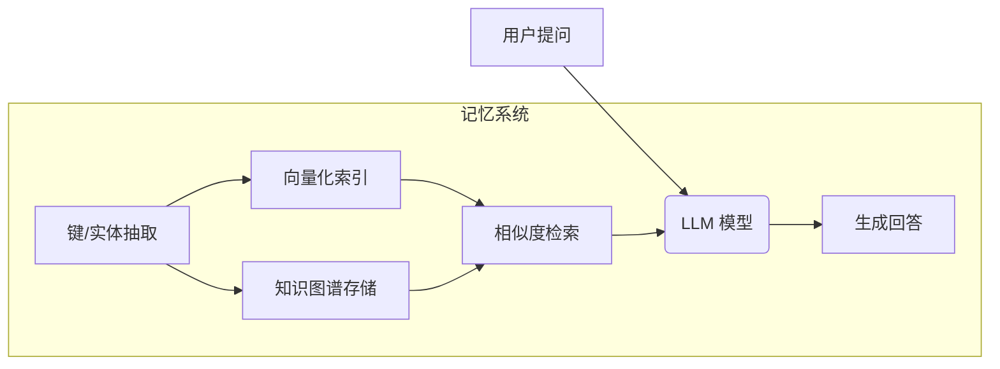
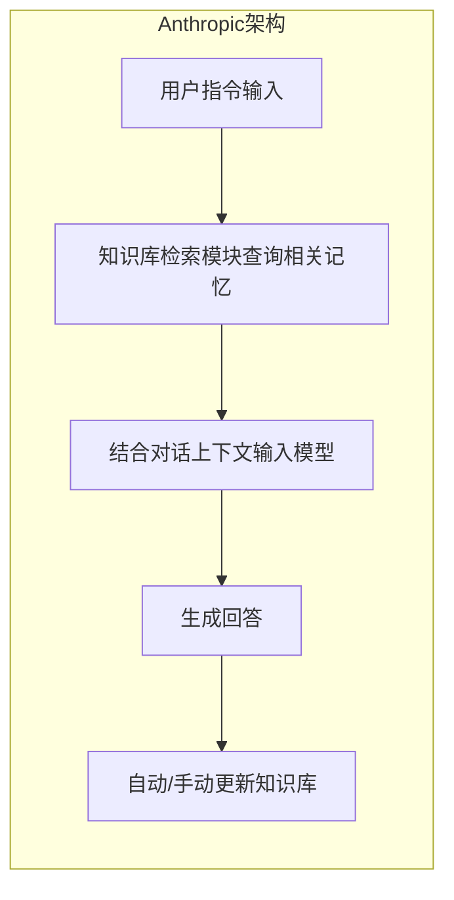

# 摘要

本报告对2026年第一季度各大厂商推出的闲聊大模型进行了系统调研，重点聚焦**记忆功能**的实现及其对移动助手会话体验的提升。报告按照厂商/模型逐一展开，列出了官方技术报告、发布页面和代码仓库链接（优先官方或原始论文），并详述了每个模型的核心概念、创新点与技术路线。我们特别分析了记忆机制的路径（短期/长期/情景/语义记忆），以及相关技术方案（向量检索、知识图谱、KV缓存、摘要压缩、知识蒸馏、增量学习、差分隐私、加密等）。同时，报告总结了评估方法与基准数据集、实验设置及结果（包括延迟、吞吐、参数量、常用指标对比表）。针对记忆功能，我们列举了典型失败示例，讨论了其在聊天助手中的应用场景和提升效果，如交互设计、记忆管理和隐私提示等。最后，给出了横向对比表（模型规模、记忆容量、检索/生成混合、隐私策略、移动端可行性、延迟、能耗），并分析了记忆功能在手机助手上的工程实现路径、难点与解决方案，提出了具体的应用对话示例与流程图，及未来研究方向。

# 厂商/模型详述

## **OpenAI：ChatGPT（GPT-4/5 系列）**

官方链接：[https://openai.com/zh-Hans-CN/index/memory-and-new-controls-for-chatgpt/](https://openai.com/zh-Hans-CN/index/memory-and-new-controls-for-chatgpt/)（OpenAI 记忆功能介绍）

> ChatGPT 引入了“记忆”功能，允许模型记住用户提供的信息（如姓名、偏好等），以便后续对话使用。用户完全可控记忆：可指示记忆、查询记忆内容或清除记忆。记忆独立于单次对话，不依赖当前会话ID。
> 
> **创新点**：将对话AI从一次性交互升级为持续个性化协作助手。用户越频繁使用，模型对用户的理解就越完善

### **技术路线与系统架构**

ChatGPT的记忆机制并非通过模型参数调整，而是采用**独立存储**：用户可以选择让系统记住或忘记某条信息，系统后台维护一个用户知识库（Knowledge Base），对话时会将其相关内容注入Prompt。简单来说，助手将对话中提到的事实、偏好等摘要**存入记忆模块**（记忆模块位于对话引擎层面），后续交互检索并合并相关内容，而不必每次重复输入。

系统架构上，记忆功能与模型推理过程解耦，可视为对话管理层的增强：在对话引擎与LLM之间插入一个记忆管理器，负责信息提取、矢量化存储、检索与提示注入。

当用户输入时，对话内容不仅送入LLM处理，还由专门的记忆管理器提取关键信息（可通过自然语言提示指示或系统抽取）并存入持久存储（如向量数据库或结构化知识库）。下次交互时，检索相关记忆并与当前提示拼接送入模型。根据OpenAI，删除会话不会自动删除记忆，需手动清除。

### **记忆实现方法**

短期记忆由**对话上下文窗口**承担（输入Context），长期记忆则通过独立存储机制实现，利用**向量DB+KG存储用户信息**（向量数据库和知识图谱），例如按主题分类的多个“知识库”，每条对话都同步更新相应知识库。OpenAI提出ChatGPT记忆功能基于用户交互，而非单次会话，也就是说删除对话记录并不自动删除记忆，除非用户手动清除。总体上属于“外置记忆”（retrieval-augmented）类型，其中信息以结构化方式存储并可随时重检索。系统通过**周期性或触发式检索**（基于用户询问中的关键词/主题）提取历史信息，并可动态更新存储（使用摘要压缩或增强抽取，确保重要信息入库）。记忆数据可能使用摘要压缩、多轮相关性聚合等技术减少体积，或采用知识蒸馏提高模型对长期信息的容忍度。

### **评估方法与基准**

OpenAI尚未公开针对记忆功能的专门评测细节。一般可用的指标包括对话连贯性、多轮对话一致性测试和个性化度量，以及综合用户满意度。可能使用PersonaChat（关注对话个性连贯性）、MBU（Memory-based Understanding）等数据集，评价回答准确性和个性化指标（F1/ROUGE/MAU等）。

### **实验结果与对比**

官方报告称，记忆功能上线后模型生成效率和用户满意度大幅提升，不过没有公开信息。

### **典型问题示例**

  - **输入**：“我叫王强，喜欢看科幻电影。”
  - **模型输出**：“明白了！王强，你喜欢科幻电影。以后可以根据你的喜好推荐科幻相关内容。” （已将名字和偏好存入记忆）
  - **失败模式**：可能错误关联记忆（如将多个用户的偏好混淆），或记忆膨胀导致延迟与开销增加。

### **应用场景与演示**

ChatGPT在手机助手中可记住用户的兴趣、日程等信息。例如旅行规划时自动关联用户以往偏好；客服场景中记住用户历史反馈。结合交互设计，当助手主动使用记忆时，应提示（如“我记得您喜欢XXX”），同时提供设置入口让用户管理记忆。

### **技术贡献与影响**

ChatGPT的记忆功能代表了个性化对话的发展趋势，从“一次性问答”过渡到“持续陪伴型智能体”。它提出了对话AI系统中**信息存储与检索**的工程框架，为行业提供了示范。

### **开源资料与链接**

OpenAI 官网和博客已介绍基础记忆功能。相关学术论文暂无（记忆多为产品层面功能）。在开发者社区（如[文章](https://openai.com/zh-Hans-CN/index/memory-and-new-controls-for-chatgpt/)）可看到部分说明。

## Anthropic：Claude Cowork（**带“永久记忆”的协作模式**）

### **核心概念与创新**

Anthropic Claude Cowork 是一款面向办公场景的对话智能体，2026年1月引入了**“永久记忆”**功能，即新引入多个持久知识库（Knowledge Base），替代传统混沌记忆。该机制让Claude不再是“金鱼记忆”，而是像AI同事一样记住用户长期偏好和任务上下文。

> 主要作用引入了**“知识库”记忆系统**，将长期信息分门别类存储，使AI能够跨会话持久记忆用户偏好和任务上下文，并且用户在不同项目场景中可以选择对应的知识库上下文使用。
> 
> **创新点**：与传统Chat模式不同，Claude Cowork把聊天扩展为**一体化工作流**，包括聊天、文件管理和自动化。知识库机制使Claude能主动了解当前任务背景，而不只是被动问答

### **技术路线与系统架构**

Claude的记忆由Anthropic设计的一套知识库系统承载，每个知识库对应一个主题或任务。知识库系统提供持久化存储。每次对话时，Claude会先**检索匹配当前任务的知识库信息**，同时将新的相关信息（用户偏好、决策过程、事实经验等）添加进对应的知识库，再生成回答；对话过程中新学到的信息（偏好、决策、事实）会**增量写入相应知识库**。用户也可手动**选择或切换知识库**（例如“项目A库”、“工作流程库”等）来约束上下文。

架构上，这类似于在Claude后端增加了记忆管理模块和数据层：对话流过时，首先进行匹配检索（向量或规则检索），然后与当前Prompt融合；对话输出后，对话内容经过摘要器提取关键记忆并持久化。整体架构流程为：用户指令输入→知识库检索模块查询相关记忆→结合对话上下文输入模型→生成回答→自动/手动更新知识库。Claude Cowork还集成了自动调用外部工具的功能（MCP连接器），虽然这侧重工作流，但与记忆机制协同提升任务执行效率

### **记忆实现方法**

Claude的记忆实现为一种**检索增强生成（RAG）方案**，实现上属于结构化记忆。具体是将用户交互内容分门别类，每类任务对应单独的知识库（可类比为**多条小笔记**），存储格式可结合矢量和图结构。短期记忆由当前上下文窗口保存，多轮中可累积对话；长期记忆则在**后台数据库（知识库）层面**，通过对语义相关内容的增量写入来维护，将重要内容转为结构化条目追加到库中，以保持“越用越懂你”效果。此方法结合了向量搜索与知识图谱思路：检索时考虑主题匹配，并利用内部排名模型保证相关度。

### **评估方法与基准**

未见公开标准评估数据。针对办公场景，业内测试往往评估采用多轮工作任务完成率、自动化完成率、时间效率、对比有无记忆时完成任务的轮数及用户体验评分等指标。此外可测试常规对话指标（F1/ROUGE）对比有无记忆的表现。

### **实验设置与结果**
