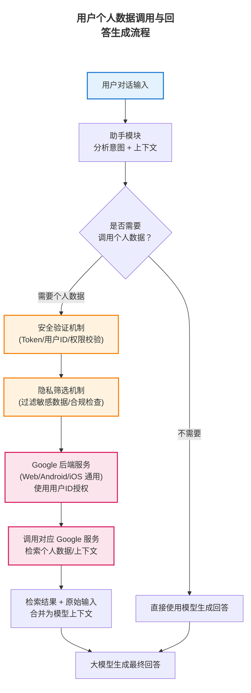

根据报道，启用记忆后，Claude能更好地完成复杂任务，例如自动完成多步骤工作流任务时所需交互明显减少。内部测试显示其在某办公场景下对话效率显著提高。根据披露，记忆功能使Claude在复杂任务中比传统模式需要更少交互轮数。示例表明，在自动化和文件管理等连续任务中，知识库记忆使Claude更能连贯推进工作。具体指标报告不详。（[链接地址](https://www.eet-china.com/mp/a456828.html#:~:text=%E6%8F%90%E4%BA%A4%E5%8A%9E%E5%85%AC%E5%AE%A1%E6%89%B9%E3%80%81%E8%AE%A2%E9%AB%98%E9%93%81%E7%A5%A8%E7%AD%89%E4%B8%80%E7%B3%BB%E5%88%97%E5%A4%8D%E6%9D%82%E6%93%8D%E4%BD%9C%EF%BC%8C%E6%8A%8A%E5%8E%9F%E6%9C%AC%E9%9C%80%E8%A6%81%E6%89%8B%E5%8A%A8%E5%88%87%E6%8D%A2%E5%A4%9A%E4%B8%AAApp%E7%9A%84%E6%B5%81%E7%A8%8B%E4%B8%80%E7%AB%99%E5%BC%8F%E6%90%9E%E5%AE%9A%E3%80%82)）

### **典型问题示例**

  - **输入**：“上次我说我喜欢项目管理的建议。”
  - **模型输出**：“是的，您之前提到了对项目管理方法感兴趣。我们可以根据这一偏好推荐一些书籍或工具。”（利用持久化记忆）
  - **失败模式**：可能出现记忆错置（将相似用户信息混淆）或过时信息未及时更新（记忆库中旧信息被错误使用）。

  #### 示例二：

  - **输入**：用户在项目讨论时指示：“将我的假期安排加入旅行知识库”。
  - **输出**：Claude能记住该任务并在下次询问中正确调用。**（正常案例）**
  - **失败模式**：如果知识库分类出错，回答可能提取错库内容；或新增记忆的过程重复、遗漏关键细节。

### **应用场景与演示**

A企业协作助手，如自动汇总会议记录、持续的项目跟进等。针对手机助手，记忆功能相当于“工作知识库”，可用于记住用户的长期目标或偏好（如健身计划、学习安排等），提高多轮对话的连贯性和个性化。当助手主动使用记忆给出建议时，应在UI中提示，如“我根据您的项目资料推荐...”。

### **技术贡献与影响**

Anthropic首次提出“知识库+长期记忆”框架，实现了对话AI的**持续协作**模式。此举在行业引发关注，被视为办公自动化智能体的重要突破（如[36氪报道](https://36kr.com/p/3646147182595974#:~:text=%E7%9F%A5%E8%AF%86%E5%BA%93%E5%86%85%E9%83%A8%E6%8C%87%E4%BB%A4)所述），推动AI助手从“问答”向“执行+记忆并重”的方向发展。

### **开源资料与链接**

Claude相关升级目前以新闻报道为主，Anthropic官方暂未发布技术论文。部分细节可参考36氪报道。[由于X无法打开，但也附上相关链接[https://x.com/testingcatalog/status/2012891786226626919](https://x.com/testingcatalog/status/2012891786226626919) 、

[https://www.testingcatalog.com/anthropic-works-on-knowledge-bases-for-claude-cowork/](https://www.testingcatalog.com/anthropic-works-on-knowledge-bases-for-claude-cowork/) ]

## Google：Gemini**(Personal Intelligence)**

官方链接：

[https://ai.google/static/documents/building_personal_intelligence.pdf](https://ai.google/static/documents/building_personal_intelligence.pdf)（Gemini相关方法论技术报告）

### **核心概念与创新**

Google 在2026年1月为其对话助手Gemini 3代新增“**Personal Intelligence**”功能，允许用户授权接入其Gmail、Google Photos、YouTube等私有数据（Beta）。

> Personal Intelligence功能本质上为对话AI注入了**个人知识源**，可视为向个人记忆（邮箱、相册内容）开放查询，增强对话的个性化与上下文关联，据此生成更加个性化的回复。
> 
> **创新点**：通过将助手接入用户熟悉的Google生态，直接利用现成的个人数据进行知识检索和推理。区别于ChatGPT等用户自述背景的方法，Gemini可“**主动推理**”：在回答时自动抓取电子邮件细节或照片中的信息

### **技术路线与系统架构**

在技术上，Personal Intelligence 属于**隐私感知的RAG范式**：用户在设定中明确授权后，后台检索Gmail、相册、搜索历史等信息，通过**专用API**安全地把检索结果拼接进模型并注入模型上下文。Google强调相关性和隐私：只有在Gemini判断有帮助时才使用Personal Intelligence，否则默认关闭。

系统架构上，Gemini接口层与Google各产品生态（邮件、照片等）相连，查询时先调用安全审核和实体识别模块，再通过向量或关键字搜索提取用户数据，并由Gemini生成回答。这相当于为Gemini搭建了一个用户级知识库和检索引擎。**具体的架构流程**：用户对话→助手模块分析是否需要调用个人数据→若是，则调用对应Google服务检索信息（使用用户ID授权）→将检索到的上下文信息与模型输入合并→生成回答。该流程需要与Google后端紧耦合（Web、Android、iOS皆可支持），并附带安全验证与隐私筛选机制。

### **记忆实现方法**

长期“记忆”由用户数据提供：例如Gemini可以“记住”用户过去的预订信息或照片内容，但这些记忆存储在Google的产品数据库中，由搜索功能即时提取。短期记忆仍由对话上下文承载。用户数据严格隔离，授权后按需检索而不是永久写入Gemini本身。这不是传统意义的“记忆存储”，而是**对用户数据的实时检索**。短期记忆仍来自会话上下文，长期“记忆”是用户账号下已有的数据集合。系统使用的技术包括索引和检索引擎（匹配邮件、照片内容）以及结合多模态信息的推理引擎。Google提到的两大能力是“跨复杂信息源推理”和“从邮件/照片检索具体细节”。用户数据在检索后仅用于本次对话，不做模型训练，符合**差分隐私策略**。

### **评估方法与基准**

**尚未披露公开评估方法**。Google 可能使用内部和标准化的个人化QA基准来评估该功能，如个性化QA数据集，使用真实用户数据进行离线测试以及A/B测试衡量用户满意度提升，评估回答质量提升及隐私合规率。指标包括回答正确率、召回召准确度等。

### **实验设置与结果**

**尚未披露公开实验结果**。Google和媒体称此功能可提高多域问题解答能力。隐私可控方面，Google将此功能默认关闭，并只在用户许可后应用。

**典型问题示例**

  - **输入**：“我的下一个航班是什么时候？”
  - **模型输出**：“根据您的Gmail预订信息，您下次航班是5月10日飞往纽约的MU535航班。”（模型查询了用户邮箱）
  - **失败模式**：可能误检无关信息或隐私问题，如授权后对话泄露。

**      示例二：**

  - **输入**：“Gemini，我下周末的日程怎么样？”（已授权邮箱访问）
  - **输出**：“您下周末没有预定日程。要安排出行可以考虑周六的航班。（从Gmail日历检索到用户无日程）
  - **失败模式**：误将不相关邮件信息当作个人数据导致回答错误；或者在隐私栏对敏感信息检索时被拒绝或过滤，给出无效回答。

### **应用场景与演示**

移动助手可在获得用户授权后自动关注日程提醒、照片备忘（如“这张照片里的是谁？”）等，实现更自然的个性化交互。在助手界面上应清晰提示“Personal Intelligence”开启情况和数据使用范围，并提供随时关闭的权限控制。

### **技术贡献与影响**

Personal Intelligence将Google在多模态和隐私保护方面的技术集成到对话助手，使模型可以直接利用个人数据提升用户体验。这标志着对话AI进一步打通个人生态系统，对行业产生了强大示范效应。

### **开源资料与链接**

Google暂无相关论文公开。主要信息来自[媒体报道](https://fortune.com/2026/01/14/google-gemini-ai-personal-assistant-gmail-photos-youtube-history-personal-intelligence/)和[官方公告](https://blog.google/innovation-and-ai/products/gemini-app/personal-intelligence/#:~:text=Personal%20Intelligence%20securely%20connects%20information,to%20be%20simple%20and%20secure)。

## 百度：文心一言 5.0（ERNIE 5.0）

官方链接：

[https://ernie.baidu.com/blog/posts/ernie5.0/#:~:text=ERNIE%205,within%20a%20single%20autoregressive%20framework](https://ernie.baidu.com/blog/posts/ernie5.0/#:~:text=ERNIE%205,within%20a%20single%20autoregressive%20framework)（百度文心 ERNIE 5.0 官方博客）

### **核心概念与创新**

2026年1月22日，百度发布了新一代多模态大模型“文心一言5.0（ERNIE 5.0）”，参数量2.4万亿。其创新点是“原生全模态统一建模”，摒弃传统“后期融合”方案，而在自回归架构下同时优化文本、图像、音频和视频等多源数据。

> 创新点：
> 