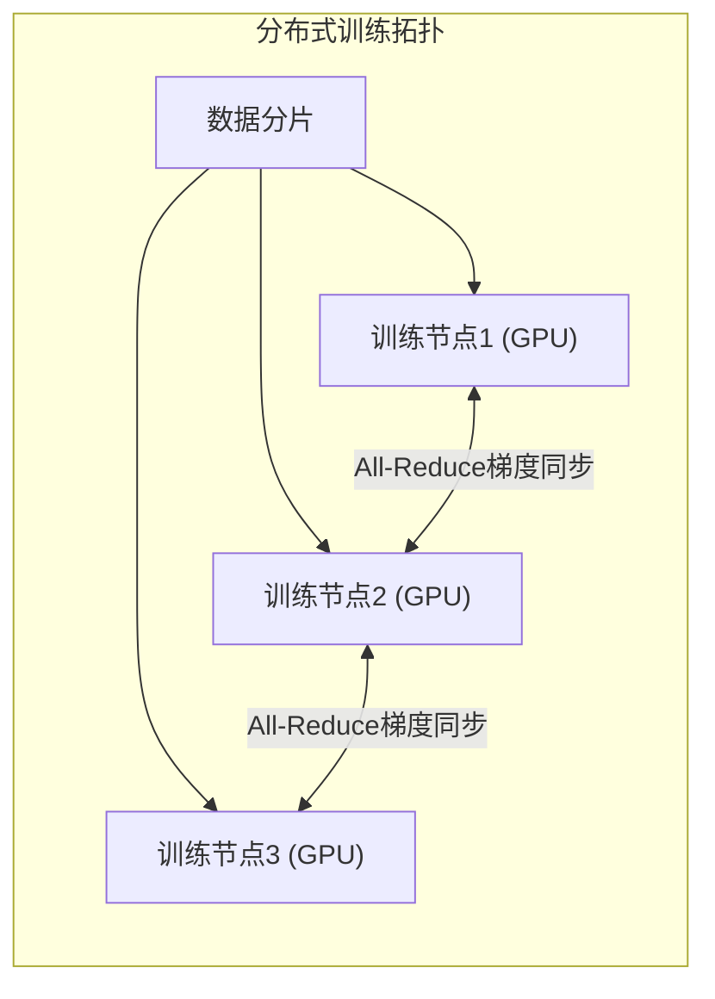
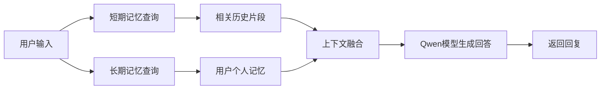

本节将逐步详述训练管线（数据→预训练→微调→对齐→评估→部署），配以时序表、Mermaid图示架构/记忆流/并行拓扑，并列出各模型变种对比表、记忆方案比较表、典型实验配置示例和失败案例分析。

主要来源（[知乎官方报告](https://zhuanlan.zhihu.com/p/2006789234372134675)、[知乎](https://zhuanlan.zhihu.com/p/2009921304921387234)、[新闻报道](https://www.guancha.cn/economy/2026_01_27_805145.shtml)、[模型权重](http:// Hugging Face - Qwen/Qwen3.5-4B-Chat)、[技术文档](http:// Qwen.ai/blog/qwen3.5-memory-arch)）

### **数据收集与预处理**

#### **语料规模与来源**

公开资料未详述具体语料，但官方提到预训练使用36T tokens的中英文多模态语料。可假设包括网络爬虫文本（新闻、百科、书籍）、代码库、对话日志、图像-文本对等多模态数据。通用做法是对网页抓取数据、维基百科、公共对话数据集等进行初筛。

#### **预处理流程**

典型流程包括去除低质内容、去重和过滤敏感信息。可能使用正则和语言模型过滤无意义词汇、HTML标记等。去重方面常用Shingling/MinHash识别相似文本；对多语言数据可能统一编码和分词，去除与目标语言无关的文本。

#### **多模态处理**

图像/视频数据需先用预训练视觉模型提取标签或特征，再与文本对齐。团队可能使用类似CLIP的图像编码器生成视觉嵌入，并配合字幕、OCR等技术构建图文对。

#### **多语种平衡**

Qwen3.5扩大到支持201种语言，应采取平衡采样策略以避免英语语料过多倾斜，多语言词表（25万词）也显著增大。

#### **人工标注与合成数据**

训练对话模型需使用格式化指令数据和人类偏好对。通义可能利用手工编写的高质量对话对（指令-响应），并结合自动生成/翻译扩充。对于偏好数据，P-GenRM论文中使用了Chatbot Arena和PRISM等真实用户交互数据。如未公开，推测内部可能组织Labeling团队收集对话质量比较数据用于RLHF。

### **预训练阶段**

#### **模型架构**

> Qwen3.5系列采用混合注意力架构。知乎文章指出使用“Gated Delta Networks + Gated Attention”混合标准注意力，同时引入高稀疏度MoE：如35B-Model总参数350B、仅激活30B；397B-Model总参数3970B、仅激活170B，大幅提高推理效率。模型上下文窗口设计为超长（至少32K tokens，有报道“默认支持100万token上下文”），并采用统一词表应对多语言。

#### **训练配置与优化**

具体超参未公开。据Qwen博客，预训练使用了“异构并行”策略，将视觉与语言组件解耦训练，实现近100%资源利用。同时采用FP8混合精度流水线，减低显存占用50%，加速10%以上。推测使用Adam系列优化器，多阶段LR预热与衰减；可能参照GPT系列做线性warmup再cosine衰减。为稳定训练，往年经验通常设置ClipGrad、奖励样本多样化等（未公开）。

#### **计算资源**

量级达数百亿到万亿参数，估计使用数千枚GPU进行训练。官方未披露具体算力，但引用“数万亿token级训练”并使用分布式硬件。图示分布式训练拓扑示例如下：

#### **损失函数**

采用自回归语言建模的交叉熵损失，对多模态则为联合预测（先预测文本token，再可能预测图像区域标签）。为提升多任务泛化，也可能插入span预测或检索任务损失（资料未公开，假设常见的平行任务损失无明显报告）。

#### **训练过程**

预训练多轮迭代后，团队使用“强化学习增强”（如多阶段RL训练链），重点强化长思维链任务和多轮交互能力。有消息称在早期预训练基础上对全模型进行RL优训练（涉及规则奖励与模型奖励联合优化），并创新了测试时扩展机制（Test-time Scaling）以进一步提升推理效率。

### **微调与对齐（Instruction Tuning & RLHF）**

#### **指令微调**

预训练完成后进行指令调优，使模型更适应对话。公开资料未详述使用哪些数据集，但通常会应用人工编写的大规模“指令-回复”对。假设通义千问团队整合了中文社交媒体问答和国际指令集（如Alpaca、Vicuna等）进行SFT。

#### **个性化奖励模型（P-GenRM）**

P-GenRM是官方提出的个性化RLHF方法。流程包括：①构建用户画像与原型；②收集用户对话偏好（例如在Chatbot Arena/PRISM收集真实用户反馈标注）；③训练奖励模型，输出适合特定用户原型的分数；④在强化学习阶段使用此奖励模型指导生成。实验表明，P-GenRM在Chatbot Arena上的平均评分准确度提升2.31%，启用测试时扩展后进一步提升约3%。这意味着微调阶段注重多样化用户需求，而非仅优化固定指标。

#### **人类偏好收集**

资料未公开细节。通常会组织数十到数百名标注员，给模型生成结果排序反馈。P-GenRM相关工作中使用了真实用户对话及专家评价。可能采取多阶段标注：先自动筛选再人工审核，以获得高质量偏好数据。中国大型对话项目经验也表明偏好标注往往包括“哪条回答更有帮助/更符合人格”的选择题，分配给多个标注员交叉验证。

#### **内嵌链式思考**

为提升复杂问答表现，可能使用链式思考（CoT）技术训练模型生成推理步骤。Qwen3.5博客提及“长思维链训练”，但细节不明。推测模型在部分标注数据上要求输出多轮推理过程，以提高连贯性。

#### **内联工具调用**

Qwen3-Max具备自主调用检索、记忆、代码解释等工具的能力。可能在微调阶段加入了函数调用（Function Calling）提示数据，训练模型判断何时需要调用工具。对接多种API时需训练策略网络选择适当工具（文档未公开，假设采用现有工具链定制）。

### **多模态与Agent工具集成**

#### **视觉编码**

Qwen3系列原生多模态，可直接输入图像。实现上估计使用Vision Transformer或卷积前端提取视觉特征，并在语言解码器中嵌入查询向量。通义千问文档提到“早期文本-视觉融合”，说明在预训练时加入了图像-文本对，模型自带图像编码能力。

#### **工具与环境**

Qwen3-Max-Thinking版本强调智能体功能，可调用「搜索」、「个性化记忆」、「代码解释器」等。在训练中可能使用Agent环境（搜索引擎交互、代码执行环境）对模型进行微调，比如通过模拟交互数据教会模型使用工具。具体管道：给出问题，若模型预测需要调用工具，则生成工具API调用，后续输出依赖工具返回结果。这类数据和训练策略（如SAFT微调+RLHF）未公开，但成果表明工具调用的准确率有明显提升。

#### **思维链与工具链**

Qwen团队文档和博客中提到长思维链和调用工具的能力。训练时可能以流程：先让模型生成中间推理步骤（CoT），再将这些步骤串成决策链（Chain-of-tools）引导模型逐步输出。这涉及特殊数据集构造（可能内部）。外部新闻报道并无详实披露，但可依据通行做法：在RLHF阶段强化奖励模型评估模型多步推理的表现，或使用强化学习环节惩罚不调用工具就试图直接回答的情况。

### **记忆与RAG集成**

#### **记忆索引**

Qwen Chat已上线长期记忆功能。这实际是一种检索系统：用户对话的关键信息以结构化记忆存储，在后续对话中由检索模块恢复。因此训练时不太可能将记忆直接融入预训练，而是通过强化学习和用户交互阶段生成记忆。当模型需要回答时，会对话中自动查询个人记忆数据库，并将相关内容放入上下文。

#### **检索训练**

如同RAG流程，可能对比训练过程：给定用户输入和存储的历史会话（或知识片段），模型需学习检索相关内容。在微调阶段可通过“难负样本”训练：例如训练模型区分正确记忆片段和随机片段，类似BERT的对比损失（假设方法）。官方文档没有细节披露，推测此部分采用检索增强技术逐步调教。

#### **混合检索**

Qwen-Agent实践中使用了关键词检索和向量检索的混合策略。记忆加入时也可采用类似方式：先用关键词过滤，然后向量相似度细筛。训练时可以使用从对话历史自动抽取的“摘要”或文档作为检索目标，训练模型理解何时调用长文检索。

#### **联合训练 vs 后续集成**

现有信息显示，Qwen预训练阶段并不嵌入记忆检索机制，更多像是后端服务集成。在对齐阶段和应用中再接入RAG和记忆系统，即微调后和部署阶段的工程集成。同时P-GenRM可以被视作一种为记忆赋分的“算法奖励”，但并非显式把记忆当作输入。

下面示例Mermaid图描述了对话中的记忆调用流程：

### **量化与蒸馏（移动部署）**
