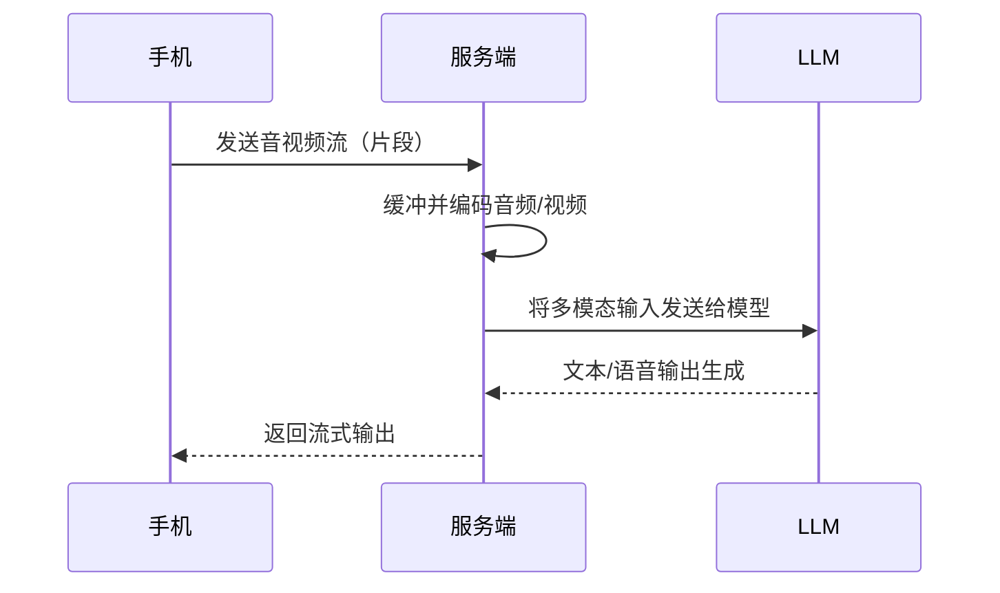

**记忆实现方法**：RynnBrain的“记忆”属于情景+语义存储：例如，当机器人任务被打断，模型内部既保留任务的语义描述，也记录具体空间位置信息。这类似在模型参数层面隐式学习了记忆能力，而非外部数据库；换言之，它是端对端神经模型中的长时记忆能力，用于保存任务相关经验。

**评估方法与基准**：达摩院同时公布了**RynnBrain-Bench**评测基准，包含物体识别、空间推理、轨迹预测等16个维度。RynnBrain在这些具身智能任务上刷新了SOTA记录，超过谷歌Gemini Robotics ER 1.5等顶尖模型。

**实验设置与结果**：RynnBrain使用2千多万个多模态视频帧对训练数据，加速比Qwen3-VL两倍，达到高效训练。公开指标显示其具身能力全方位领先，包括环境感知、对象推理、视觉QA、空间推理、轨迹预测等。与长时记忆直接相关的是模型可预测动作变化的精度，也显著优于竞品。

**典型问题示例**：

- **输入**：机器人被指令“暂停当前任务，先完成B任务”。
- **模型输出**：“好的，我记住了任务A当前位置。完成B任务后我会继续完成A。” （RynnBrain记住了中断时的状态）。

**应用场景与演示**：RynnBrain可用于工业机器人、服务机器人等领域，例如自动仓储、巡检机器人。演示中可见机器人凭借时空记忆在复杂场景中自如切换任务。

**技术贡献与影响**：RynnBrain是业内首个公开的带时空记忆能力的具身AI基座模型。它将机器人智能体研究推向了新高度，对具身智能领域有重要意义。阿里开源该模型及评测，促进了业界对机器人记忆能力的关注。

**开源资料与链接**：阿里达摩院开放了RynnBrain全系列模型及评测基准，详细信息可参见环球网报道。相关论文或代码仓库尚待发布。

**阿里云记忆引擎**：此外，阿里云推出了**Polar Agent Memory**长期记忆引擎（文档已发布），可部署于PolarDB AI节点，通过向量检索和知识图谱双模存储，实现对话记忆的端到端管理。该系统可自动提取对话关键信息并持久化，大幅降低响应延迟和Token消耗。例如，使用该引擎后响应时间降低30%、回答质量提升40%；记忆存储结合向量数据库与图数据库，通过多路检索和重排序确保准确召回。该记忆引擎强调**动态更新与一致性管理**：删除会话时自动失效或重建相关记忆。

## **Qwen Omni 模型（多模态整合模型）**

官方链接：[https://arxiv.org/abs/2503.20215](https://arxiv.org/abs/2503.20215) （Tech report）[https://huggingface.co/Qwen/Qwen3-Omni-30B-A3B-Instruct](https://huggingface.co/Qwen/Qwen3-Omni-30B-A3B-Instruct)（hugging face）

[https://help.aliyun.com/zh/model-studio/qwen-omni](https://help.aliyun.com/zh/model-studio/qwen-omni)（阿里云文档）

**Qwen-Omni** 系列（如 Qwen3.5-Omni，2025年开源）是阿里通义千问推出的端到端**全模态**大模型。该系列提供 Plus、Flash、Light 三种不同尺寸的 Instruct 版本，以满足多样化的应用需求。在架构上，其** Thinker 与 Talker 模块**均采用了先进的** Hybrid-Attention MoE 架构，**并基于海量文本、视觉数据及超过 1 亿小时的音视频数据进行了原生多模态预训练。 Qwen3.5-Omni 在全模态感知与生成能力上实现了显著突破：支持 256k 超长上下文，可处理超过 10 小时的纯音频或 400 秒的音视频输入。在语言覆盖方面，模型支持 113 种 语种和方言的语音识别，以及 36 种语种和方言的语音生成。

> **创新点**
> 
> **Thinker-Talker 架构**（Thinker 做语言“思考”，生成文本语义向量；Talker 负责语音生成）
> 
> **TMRoPE 时间多模态位置编码**，在统一时间粒度内对音频和视频帧进行对齐。
> 
> 模型采用 Transformer 结构，大量共享参数于多模态流，语音/视频输入通过独立编码器转换为序列嵌入后送入同一模型。Qwen-Omni 属于多任务学习，与 Qwen2.5 一样在各模态数据上训练，强调流式实时响应，因此模型内存主要体现在巨大的隐藏层和双向解码器，而非显式持久记忆。

### 记忆机制路径

Qwen-Omni 没有特定的记忆组件。它通过**超长上下文和内部注意力机制**将多模态信息融入推理（每次对话会话缓存于 Context Window）。在实时应用中，可结合外部缓存或知识检索，但模型本身仅靠内部参数学习到的模式。索引采用由服务端管理的 KV 缓存和先前上下文（长度依赖于环境）；无额外哈希或向量数据库机制。连续对话场景下，系统通常保持会话状态，但实时视频/音频输入主要使用流式处理，而非传统的检索式记忆。

### 训练流程

Qwen-Omni 在通义千问大规模多模态语料上训练，包括文本-图像、文本-音频对，以及视频/语音说明对。采用分模态预训练 + 多模态联合训练的策略。预处理涉及文本分词、图像patch编码、音频特征提取（如80D语谱图），视频按帧采样。损失通常为语言模型交叉熵，还可能包含对齐损失（例如图像字幕匹配）。优化算法通常为 AdamW，同样采用混合精度和梯度累积。该模型庞大（最大全参数量未知，推测>100B），训练需要数千GPU并行。官方提到 Qwen-Omni-实时服务（Omni-Realtime）在推理上进行了特定优化，以确保低延时。

### 系统架构与移动集成

Qwen-Omni 核心部署在云端，手机端通过双向流式 API 与其交互。实时音视频交互示例中，客户端不断上传音视频流，服务端缓冲并处理。该架构要求严密的低延时管道，如使用 GPU+NPU 混合推理、流式API协议。移动端集成时可结合本地特征提取（边缘预处理帧），将预处理结果流给云端。下图为 Omni-Realtime 服务交互流程：

### 评估基准

Qwen-Omni 的评测包括多模态交互任务：如图文描述、视觉问答（VQA）、多模态对话、语音对话。官方强调流式输出，应测试端到端交互延迟和多轮一致性。可使用标准多模态数据集（MSCOCO、VQA、MULTI-MODAL DSTC等）评估理解能力；实时场景下构造 HumanEval 多模态版，或使用 AudioSet/VidEval 类基准评测端到端性能。两类场景下：**低延时闲聊**测试目标应在 <500ms 内响应（音频流式处理有320ms帧延迟等）；**深度研究**则可测试复杂多模态检索准确率和长对话连贯性。

#### 离线（Offline）

  - 模型性能领先 Qwen3.5-Omni-Plus在音频/音视频的理解、推理和交互任务上共取得了 215 项子任务/Benchmark的 SOTA 成绩。
  - 音视频caption 支持生成可控的，详细的，结构化音视频caption，并生成剧本级细粒度描述，包括自动切片，时间戳打标和人物与音频关系的详细介绍。
  - Audio-Visual Vibe Coding 通过原生多模态Scaling，涌现出可以根据音视频指令直接进行coding的能力。

#### 实时(Realtime)

  - 语义打断 自动识别turn-talking意图，避免附和和无意义背景音打断，让对话交互更加自然流畅。
  - 工具调用 支持WebSearch和复杂FunctionCall的调用，模型自主判断是否需要拉起WebSearch来回应即时问题。
  - 端到端的语音控制和对话 自由控制声音的大小/语速/情绪等，实现拟人化语音交互。
  - 声音克隆 支持用户上传音色，自定义人工智能助手的音色
  - 语音合成优化 针对语音不稳定性，如漏读、误读或数字发音模糊等问题，提出了ARIA技术动态对齐文本与语音单元，显著提升了语音合成的自然度与鲁棒性。

### 实验结果

Qwen-Omni 在多模态任务上取得 SOTA 性能，据称在100+测试中胜过其他同类模型。例如在多模态问答中，其流式文本生成与语音输出均达到高准确度。Thinker-Talker 架构使得文本和语音生成并行而互不干扰，音视频的时间对齐机制也显著提升理解一致性。具体指标尚未公开，但业内报告表明 Qwen-Omni 在实时对话延迟上优于非流式模型。由于模型规模庞大（暂未知确切参数），其单轮推理延迟相对较高，但通过流式解码部分掩盖感知延时。失效场景包括：极端复杂的多模态场景（如高速运动的视频）对齐错误，及语音识别与文本生成之间的延时错配。

