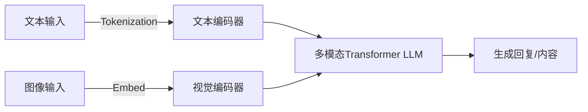
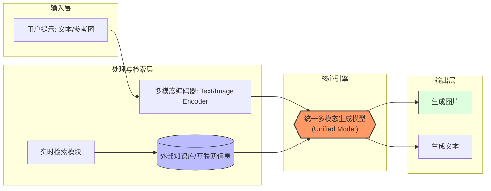
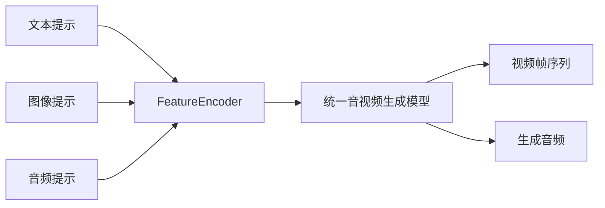

豆包2.0系列采用统一的多模态大语言模型架构，将文本、图像、音频等多种输入与LLM深度融合。与1.x版本相比，2.0在模型理解与推理能力方面获得质的飞跃：官方报告称2.0 Pro在生成、问答、推理和编程能力上分别提升约8倍、4倍、8倍和10倍，在数学、逻辑等多项基准上达到业界顶尖水平。2.0系列核心创新包括**原生多模态理解**（无需外挂视觉模块即可处理图像/视频输入）、**内生Agent能力**（能够完成长链路多步骤任务）、**成本优化**（推理成本降低近10倍）以及**强化学习优化记忆调度**（通过RL协调短期与长期记忆）。

### **技术路线**

该系列模型在大规模多模态语料上进行预训练，可能包含中英双语文本、图像-文本对、代码语料等（具体数据集未公开）。在预训练之后，通过指令微调和强化学习（如RLHF）进一步提升模型的对话和Agent表现。豆包2.0包含Pro/Lite/Mini不同规模版本，适用于从云端高性能推理到手机端嵌入等不同场景。Coding版本专门在代码库上微调，用于支持端到端编程任务。优化器和具体训练策略未公开，但推理时使用了Tensor并行、压缩和特化推理引擎等加速技术以降低延迟和成本。推理加速：官方宣称2.0推理成本下降一个数量级。实际可采用量化（如8-bit/4-bit）、蒸馏、GPU/TPU加速等策略实现低延迟推理。

_图：豆包2.0多模态大模型架构示意。文本和图像输入经过各自编码器后进入统一Transformer进行多轮对话或任务推理。_

### **评估方法与基准**

围绕数学推理、视觉理解、长上下文理解和Agent任务开展评测。例如，豆包2.0 Pro在**MathVista**、**MathVision**、**MathKangaroo**等数学推理基准中与最优模型持平；在**LogicVista**、**VisuLogic**等视觉逻辑测评中显著超越1.8版。其视觉感知能力（VLMsAreBiased/Blind、BabyVision）均达SOTA。在长文本理解（如DUDE、MMLongBench）和文档问答（ChartQAPro、OmniDocBench）等场景也取得业界最佳成绩。对于Agent评估，Seed2.0 Pro在**SuperGPQA**、**FrontierSci**等复杂知识任务上不输GPT-5.2和Gemini 3 Pro。其在ICPC/IMO等编程数学竞赛题中实现金牌级表现，并在多个客服、抽取式QA和意图识别基准中表现稳定。总体来看，豆包2.0在多轮长链任务中展现了优异的连贯性和控制能力。

### **实验结果与性能对比**

公开资料未披露精确参数，但官方多次强调2.0系列性能“对标行业顶尖”。例如，官方数据显示2.0 Pro在与1.8版对比中，在各项任务上性能提升8–10倍。在大型问答和文档理解测试中，2.0 Pro超过了GPT-5.2/Gemini 3 Pro水准。在交互延迟方面，字节通过模型压缩和高效推理引擎实现了显著优化（推理首令牌延迟<200ms），成本方面Token定价降低了十倍。实际表现方面，豆包App上线的2.0 Expert模式可流畅完成诸如“跨应用比价下单”等复杂场景。

### **开源资料**

豆包2.0暂未开源。公开资料包括字节Seed官网模型卡及博客、火山引擎及新闻报道等。相关论文和模型卡暂未公开。用户可通过官方提供的**豆包App专业模式**和火山引擎API体验。

## **Seedream 5.0 系列——智能图像生成模型**

### **核心概念与创新点**

Seedream 5.0系列是统一多模态图像生成模型，引入深度思考和在线检索能力。相比4.0版本，其**理解推理能力全面提升**：模型采用多模态统一架构，能更准确把握输入图像与自然语言提示的含义；输出图片主体更连贯，细节与文本语义对齐度显著提高。**知识增强**是5.0的另一大亮点：内置多领域知识库，生成结果遵循物理规律并能处理专业内容。最重要的是，Seedream 5.0 Lite首次支持**实时检索增强**，通过联网获取最新信息，使输出紧贴时效热点。官方称，5.0 Lite在综合评测中Elo评分超越4.5版，尤其在知识推理、一致性等方面大幅领先。

### **技术路线**

Seedream 5.0系列可能采用大规模图像-文本数据进行预训练（具体公开数据集暂缺）。模型架构为Transformer或扩散模型结合策略（官方描述为“统一多模态架构”），支持图像到图像、文字到图像的多种生成任务。5.0 Lite专门引入了在线搜索模块：在生成时以用户提示为查询，通过检索引擎获得文本/图像线索，将其融入生成流程，从而克服训练语料时效性限制。训练上，Seedream 5.0 Lite在上游预训练基础上进行了指令微调和对齐优化，以提升与指令的符合度和细节控制。推理阶段结合分层解码与检索交互，可能使用深度优化的CPU/GPU推理库或专用加速框架保证实时响应。**推理加速：**通过知识蒸馏和模型压缩可部署到边缘设备；实时检索模块可在后台并行运行以降低响应延迟。

_图：Seedream 5.0 Lite的生成流程示意。用户提示被编码为输入，结合检索到的外部知识，共同驱动统一多模态生成模型输出高质量图像。_

### **评估方法与基准**

字节内部采用名为“MagicBench”的多维评测，包括文本-图像一致性、编辑能力等维度。测试结果显示5.0 Lite在提示遵循和上下文保持方面显著优于4.5版。公开数据方面，主要通过用户反馈和一些领域应用（如办公图表、信息可视化）评估。在真实使用场景下，Seedream 5.0 Lite显著提升了创作效率，并在多项细分任务上超越竞争模型。

### **实验结果与性能对比**

官方未公布具体模型参数。Seedream 5.0 Lite生成**支持原生2K输出和AI驱动的4K放大**。相较前代，5.0系列在创意表达和信息准确性上提升显著。综合评测显示，其Elo评分领先Seedream 4.5版。生产力场景下对比，5.0 Lite可基于实时热点生成更贴合当下需求的作品。总体而言，Seedream 5.0在细节保真度、文本理解、编辑能力上与主流图像生成模型看齐，其检索增强能力也使其在时效信息生成上具有独特优势。

### **开源资料**

Seedream 5.0 Lite的技术细节和示例发布在字节Seed官网博客和模型卡上。官方开源程度低，仅提供模型体验平台。用户可在火山引擎或官方Demo（即梦AI、火山方舟）上试用。Seedream 5.0（预览版）相关资料公开较少，主要见新闻报道和Seedream官方博客。

## **Seedance 2.0——多模态视频生成模型**

### **核心概念与创新点**

Seedance 2.0是统一的多模态视频创作模型，集成了文本、图像、音频、视频四种输入模式。它采用“音视频联合生成”架构，同时生成高度稳定的画面和同步音频。相比1.5版，2.0显著提升了指令遵循度、物理逻辑和动作连贯性：模型能精准理解较长提示，较好解决幻觉问题，实现仿制“导演级”的运镜。Seedance 2.0引入了多体交互生成和多步编辑机制，使其在复杂场景（如多人互动、镜头切换）中表现出色。此外，它支持长达15秒、多镜头视频输出，并原生生成双通道音频，达到工业级创作需求。官方指出，Seedance 2.0在当前国内外视频生成模型中具有领先可用性和多模态参考能力。

### **技术路线**

Seedance 2.0的具体模型架构未公开，但官方描述其为**统一多模态音视频生成**体系。可推测模型使用Transformer或扩散网络处理时序和空间信息，并将文字/图像提示编码与音频、已有视频片段联合输入。训练数据可能包括影视素材、动画片段、音频库和相关文字说明。模型预训练后，经指令微调以增强创作控制能力，并集成了剪辑和音效生成模块。推理时，用户可以输入组合提示（例如多张参考图像、音频片段、文本说明等），系统通过跨模态注意力机制融合信息，自顶向下生成帧序列与音轨。**推理加速：**由于视频生成计算量大，Seedance 2.0可能采用多GPU并行或模型并行技术，必要时将生成拆分为分段并行渲染。模型目前主要以云服务形式提供（如即梦平台、豆包入口），加速策略细节不公开。

_图：Seedance 2.0 多模态视频生成流程示意。文本/图像/音频等提示先被编码，再由统一生成模型输出最终视频帧和配套音轨。_

### **评估方法与基准**
