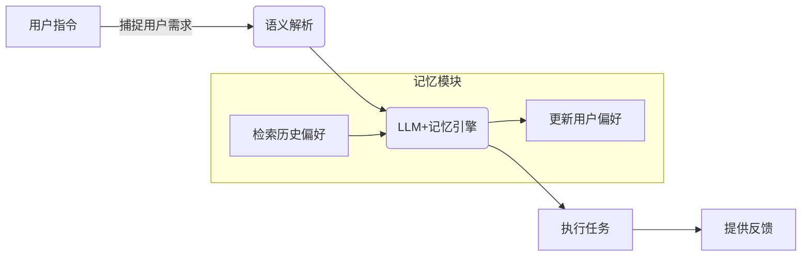
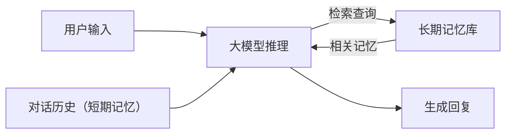

视频生成模型的评估通常结合主观和客观指标。官方提及Seedance 2.0在多项视频任务中胜过前代，并获得创作者的高度认可。由于缺乏公开基准，评估重点在于“可用性”与“稳定性”：Seedance 2.0在**TVBench**、**TempCompass**、**MotionBench**等测试中保持领先，对EgoTempo长视频基准实现超过人类水平；在流式长视频问答场景表现优异，可支持实时流分析和主动纠错等任务。综合用户体验来看，官方称Seedance 2.0已经实现导演级效果，几位业内人士对其技术突破给予肯定。开源资料中主要是官方发布的示例视频和简要说明，缺乏量化对比数据。

### **实验结果与性能对比**

公开资料未披露模型参数和具体指标。Seedance 2.0在指令遵循和分镜控制方面均有质的提升：例如，在官方展示中可实现精准的镜头运动、物理符合度高的视频输出。Seedance 2.0可以在一次生成中输出多个镜头段落（共15秒长），支持多重参考材质输入。与国际最新视频模型相比，无论在画面质量还是编辑能力上，官方宣称Seedance 2.0处于顶级水平，但缺少直接对标数据。不论如何，该模型为国产视频生成技术设立了新标杆，尤其是在指令控制和多步生成可靠性方面具有优势。

### **开源资料**

Seedance 2.0资料主要见字节Seed官方网站博客及模型页面，包括技术介绍和示例视频。目前未发布模型或代码。用户可通过即梦AI等平台体验相关功能。

## 豆包AI手机助手

### **核心概念与创新**

字节跳动于2025年12月发布了豆包AI手机助手（操作系统级预览版），内置于努比亚M153工程样机中。豆包的创新在于**将大模型变为手机的执行层**，通过系统权限和跨应用整合，让AI能自动完成复杂任务。豆包提出了“记忆功能”，使助手在连续对话中能够根据用户偏好和历史自动辅助操作，从而减少重复询问。

### **技术路线与系统架构**

豆包助手通过与手机操作系统深度集成，调用App、摄像头、传感器等资源。架构上，它包含本地触发（侧边AI键、语音、屏幕读取等）和云端推理结合的混合模式。记忆功能方面，豆包会记录用户习惯和任务上下文：示例中提到，通过记忆用户喜好（如喜欢的餐厅）来帮助自动化处理连锁任务。相当于在助手体系中加入了用户资料存储和场景关联模块。

### **记忆实现方法**

豆包目前未披露底层存储细节，但演示显示：助手可“激活记忆功能”后，在任务链中自动根据此前判断出的偏好减少确认询问。这暗示它采用会话级的上下文存储，比如将用户偏好、未完成任务状态等持久化到本地或云端。短期记忆由当前上下文和缓存承担，长期记忆则需要依赖云服务进行同步更新。

### **评估方法与基准**

豆包作为手机操作系统功能，其评估更侧重用户体验，比如任务完成率、所需交互轮数、用户满意度等，而非学术指标。

### **实验设置与结果**

公开演示表明，在完成如旅游规划和连锁购物等复杂任务时，开启记忆功能后所需提问明显减少。例如在规划出行时，助手能根据记忆锁定用户偏好景点并自动续办相关事务。

### **典型问题示例**

  - **输入**：用户对助手说：“帮我订明天上午去巴黎的机票，并把酒店预订好。”（之前用户说喜欢近市中心的酒店）。
  - **模型输出**：助手调用地图与订票服务，同时根据记忆自动选择市中心酒店并下单。
  - **失败模式**：若记忆判断错误，助手可能选择用户不愿意的选项或忽略最新偏好。

### **应用场景与演示**

豆包面向手机用户，强调跨App协同和自动化执行。例如演示中，它能跨平台比价、下单、远程开车门并触发请假流程，且记忆用户喜好后完成链式任务。豆包的推出预示着AI手机的新范式，从单纯问答转向行动执行。

### **技术贡献与影响**

豆包用实际产品验证了系统级大模型的应用路径：通过记忆和自动化将AI助手嵌入用户日常使用中。它绕开了“更大模型参数”的竞争，强调生态和体验改造，对业界的手机AI策略具有启发意义。

**开源资料与链接**：暂无开源代码。相关信息见电子工程专辑报道。

## **会话记忆实现路径与手机助手体验**

### **记忆体系结构**

会话记忆通常分为短期记忆（对话轮次间上下文）和长期记忆（跨会话的用户信息）两类。常见实现包括：

  - **向量检索增强（RAG）**：将对话历史和用户偏好保存为向量，存入向量数据库（如FAISS、Milvus），需要“回忆”时检索相关向量并添加到输入中。该方式部署简单、扩展性高，但由于缺乏结构，检索准确率易受干扰，也难以捕捉时间顺序和上下文依赖。
  - **插槽式结构化记忆**：预先定义固定的“记忆槽”，将用户信息分字段存储（如姓名、兴趣、经历等）。模型根据对话触发相应插槽，动态插入提示。此方法存取高效、精度高，但灵活性较差，插槽设计需人工定义。
  - **摘要与复盘机制**：对话结束时自动生成简短摘要，将原始对话压缩为关键信息。这种“写日记”机制可将对话精粹保留为记忆（如记录用户计划、偏好等），节省存储空间。但摘要质量依赖模型能力，易引入遗漏或错误信息。
  - **混合型记忆架构**：现代记忆系统通常综合上述方法：使用向量数据库存储原始片段数据，用插槽记录结构化长期信息（用户档案、兴趣标签），结合定期摘要压缩近期对话。业界成熟Agent框架（如Mem0、MemGPT）即采用此混合方式。InfoQ专家指出，记忆系统还需**分层管理、多粒度调度、可信更新与安全治理**等机制，确保记忆信息准确可控。

### **记忆检索与更新**

在对话过程中，短期记忆直接作为上下文窗口的一部分；长期记忆则常通过检索接口主动查询（RAG）或被动回填。例如，当用户在新对话中提到关键词时，可检索先前相关记忆加入当前提示。M3-Agent提出了“双管齐下”的设计：**记忆过程**实时处理视觉/听觉输入构建实体中心的记忆图谱，**执行过程**则在指令推理时迭代检索并利用这些记忆。此架构兼顾了记忆的“写入”与“读取”流程，并通过强化学习协调长期与短期记忆的调用。具体策略上，可引入“记忆触发器”（对话触发时关键词自动回忆）和“记忆更新规则”（过期或冲突时的安全更新）确保记忆一致性和隐私保护。

### **隐私与安全**

用户记忆往往包含敏感信息，因此需要严格的隐私保护策略。常见做法包括：**本地存储**将用户特定记忆保留在手机或个人账户中，防止未经授权的数据上行；**数据加密**确保即使泄露也难以解读；**联邦或差分隐私学习**允许模型在不泄露隐私的前提下进行个性化优化。移动端记忆系统还应提供清除、修改等交互接口让用户自主管理个人数据。InfoQ 研究强调记忆系统的**安全治理**与可信更新机制，需考虑合规法规和道德风险。综上，记忆实现需要在用户体验与隐私保护之间权衡设计。

### **资源与延迟权衡**

长期记忆库可能规模庞大，检索成本和存储开销较高。一般会采用**缓存策略**：将常用或近期记忆缓存到内存/本地存储以减少检索次数；并设置过期策略控制存储增长。移动端由于算力和存储有限，建议将**轻量级记忆库**部署在设备上（如用户偏好、定期摘要），而将大规模非敏感记忆库放在云端（配合RAG检索）。推理时可优先在本地小模型或缓存中获取答案，仅在必要时才发起云端大模型请求，从而兼顾响应时延和模型效果。下图示意基于记忆增强的对话流程：

_图：集成长期记忆的对话系统示意。模型在推理时结合对话历史，并从长期记忆库检索出相关信息，最终生成连贯回复。_

### **手机助手体验提升**

引入会话记忆可大幅增强智能助手的自然交互体验。具体表现包括：**多轮连贯性**——模型能够记住早前对话内容，避免重复提问上下文。例如，一次对话中用户谈及旅行计划，系统下次提到该信息便可主动联系。**个性化**——助手持续积累用户偏好与背景，在建议和回复中体现用户习惯（如用户偏好辣食，推荐餐厅时自动优先川菜馆）。**上下文保持**——跨应用、跨会话地保存操作记录，如豆包手机助手可在不同App间持续执行任务；记忆使得助手在复杂工作流（如比价购物、行程安排）中无需用户重复说明，主动调用历史信息并纠正错误。**纠错与回溯**——当模型产生偏差或用户纠正时，记忆可更新并校正；例如用户指出“上次你误解了我的需求”，系统可查回记忆重新生成。**用户偏好记忆**——比如系统记录用户昵称、习惯、常用地址等，在之后的闲聊或操作中即时引用，避免用户不断输入和验证。这些改进都依赖记忆模块提供可靠的长期信息支持。

### **技术方案建议**
