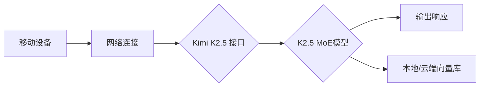

~~液体AI团队（Liquid AI）发布了面向边缘设备的~~**~~LFM2系列~~**~~模型（Liquid Foundation Models 2），主打在手机、平板等常用设备上实现媲美大型服务器级智能。其关键创新在于~~**~~硬件协同设计~~**~~：从设计初期就考虑算力与能耗约束，使模型架构天然适配各种设备。同时提出了~~**~~混合架构~~**~~：结合短程卷积（Local Conv）和分组注意力（Grouped Attention）等技术，以保持高效运算的同时深入理解复杂信息。~~

**~~技术路线与系统架构~~**

~~LFM2系列包含多种规模，从350万参数到83亿参数都有覆盖。架构上，它通过“知识传承”机制，即使用更大的模型作为教师对小模型进行蒸馏，使得小模型也具备接近大型模型的能力。此外，还研发了针对视觉（LFM2-VL）、语音（LFM2-Audio）和检索（LFM2-ColBERT）等专业化变体。系统实现在普通手机上本地推理，完全脱离云端，从而隐私友好。~~

**~~记忆实现方法~~**

~~LFM2本身未内置特殊记忆模块，其“记忆”更多指知识蒸馏与传承。小模型获得大模型知识的过程，可以理解为一种知识压缩；对话时记忆主要依赖上下文，未见专门的长期记忆设计。可能通过与检索模型（LFM2-ColBERT）结合，实现对话历史或外部知识的检索支持。~~

**~~评估方法与基准~~**

~~LFM2官方技术报告（arXiv:2511.23404）提供了基准测试，包括推理速度与准确度对比。报告称该系列在保持同类模型智慧的同时，运行速度提升2倍。公开指标为在相同设备上性能对比（如骁龙芯片推理吞吐量）。~~

**~~实验设置与结果~~**

~~公布结果显示，无论是语言理解还是视觉任务，LFM2在手机端的延迟显著低于同等规模传统模型。例如83亿版在特定硬件上推理速度比原先快两倍，且能耗更低。开发者宣称，在普通设备上可实现接近大型AI服务器的智能水平。~~

**~~典型问题示例~~**

~~液体AI并未给出具体对话案例。可以想象基于LFM2-VL，用户向手机问“这张照片里是什么植物？”，模型会回答类型并结合图像。~~

**~~应用场景与演示~~**

~~LFM2旨在让手机拥有强大的本地AI能力，例如离线助手、实时图像理解等。示例演示可能包括边拍照边理解、连续语音对话等。~~

**~~技术贡献与影响~~**

~~LFM2将移动端AI性能提升到了新高度，实现了~~_~~端侧AI模型的性能极限探索~~_~~。其“硬件协同”和“知识传承”方法为高效模型设计提供了有益思路。~~

**~~开源资料与链接~~**

~~液体AI已发布LFM2技术报告（arXiv:2511.23404）。团队官网（Liquid AI）和相关论文可获取更多细节。~~

# Kimi

Kimi 的旗舰模型**K2.5**于2026年1月发布。它基于**MoE 混合专家架构**，参数规模达约1T，支持超长上下文（256K token）。模型原生融合文本与视觉理解，特别擅长代码生成和 Agent 协作任务。核心创新包括超大上下文窗口和**Agent 集群模式**：多个模型实例可协同工作，解决多步推理和工具调用问题。

> **创新点：**
> 
> **Kimi 线性注意力**架构（Kimi Linear），将传统的全注意力替换为混合线性注意力模块。其核心是**Kimi Delta Attention (KDA)** 模块，通过为每个特征通道引入独立的遗忘门控机制，使每个特征维度拥有独立的遗忘率，进而精细地控制记忆的衰减。
> 
> 引入了特殊的对角加低秩 (DPLR)传递矩阵**参数化，用于高效实现循环式状态更新，配合分块并行算法显著降低计算复杂度。**
> 
> **总体上，Kimi 线性采用**3:1 交错结构，在大部分层使用轻量的 KDA 线性模块，并定期插入全注意力层以保证全局信息传递。这样的混合结构在短上下文下与标准 Transformer 性能相当，在长上下文下效率极高，同时显著降低了记忆开销：论文报告 KV 缓存占用减少约75%，在 100万 token 上下文长度下解码速度提升 **6×**。

## 记忆机制路径

Kimi 模型自身不嵌入持久记忆模块，主要依赖大上下文窗口保存历史状态。实际部署中常结合外部记忆插件（如 OpenClaw / memsearch）记录用户信息与日志，实现检索注入。索引通常使用语义向量检索（SQLite 或 Milvus），在模型调用时将相关记忆注入提示；无专用哈希或动态门控策略。持续学习方面，Kimi 平台支持在线微调和工具反馈，但没有像 Engram 那样的自编辑记忆机制。

## 训练流程

K2.5 架构沿袭 MoE 基础。训练数据涵盖大规模文本、代码及图像-文本对。模型可能先进行大规模通用预训练，再针对多模态和编程任务做多轮微调（如代码评测集HumanEval等）。预处理包括文本分词和视觉编码（ViT 分割图片为Patch tokens）。Loss 函数主要为交叉熵。优化器一般选用 AdamW，采用混合精度（FP16）训练，以降低显存占用。超参方面，未经公开，但可参考 Kimi K2 的示例：可能使用8K batch、渐变累积、学习率预热和衰减等。模型在数百张高端 GPU（如 NVIDIA H100）上训练，FLOPs 估计为数百ZFLOP级。检查点由 Moonshot 维护，尚未开源，但可通过其 API 调用最新版本。

## 集成架构

Kimi 线性本质上是改进的 Transformer 编码器/解码器架构，流程为用户输入文本经过 Tokenizer 后进入 Kimi-Linear 模型，模型在各层通过 KDA 模块进行高效记忆累积，与部分全注意力层交替工作，最后生成输出。在部署时，典型设置可能包括将 KDA 核心算子集成到推理引擎（如 vLLM）中，以充分利用串行解码的高吞吐优势。

针对手机助手，K2.5 可通过云端 API 提供强大语义和视觉能力。本地集成通常使用精简版（如Turbo模式）；同时结合本地缓存（memory插件）处理用户偏好。低延时场景下，可将模型部署在近端服务器，使用本地向量数据库（SQLite/Milvus）存储对话历史。移动推理时需将用户查询串流传输到云端，经检索后返回结果。下图为集成示例：

## 评估基准

使用代码和复杂任务基准评测模型能力。如 HumanEval、MBPP（编程能力），CodeXGLUE（代码理解），以及多轮Agent评测（AutoML-Bench等）。还应测试长上下文处理（动态堆栈器类输入）与工具调用准确性。延时敏感场景下，可参考ClawEval 或 LatencyBench 评测响应时延和 P90, P99 指标；容忍延时场景可加入综合问答、文档检索任务，评估信息召回率（如NIAH、RULER等长文QA基准）。据官方，K2.5在代码基准上领先（细节未公开）。

## 实验结果

K2.5据称在代码和多步骤推理任务上“领先表现”，上下文扩展到256K显著提升多轮连贯度。具体精度和延迟未公开。由于 MoE 架构，每次推理仅激活部分专家，典型通过稀疏路由大幅降低计算。模型内存占用极大（多达数百GB GPU内存），但稀疏计算使推理速度在多卡情况下保持可用水平（云端跑分最快可达几十tokens/s）。由于架构封闭，暂无公开的消融研究或失效案例。

## 典型失败案例

如其他强大模型，K2.5 可能在极长多模态对话中出现不连贯回答或偏离主题现象；在少见编程语言或漏洞修复等任务中，仍可能生成错误代码。大上下文也带来计算开销高和缓存管理复杂的问题，如长聊时 GPU缓存抖动影响性能。平台层面，K2.5 工具调用和 Agent 协作方案需专门测试，否则可能因多Agent决策逻辑冲突导致结果异常。

## 应用场景与示例

K2.5 适合代码辅助、软件开发、数据分析和多模态人机交互。示例包括：嵌入 IDE 的编程助手（生成代码、修复错误）、网页自动化（识别界面元素并执行）、可视化数据问答等。Moonshot 已提供 API 和多种工具集（Claude Code、VS Code 插件、RooCode 等）演示 K2.5 功能。实际应用中通常结合开放搜索、数据库查询等外部知识源，以辅助 K2.5 回答超出训练范围的问题。

## 技术贡献与影响

Kimi K2.5 将大型 MoE 模型推向更长上下文与多模态融合，将个人助手和自动化工具推理能力提升到新高度。其开创性的“256K长上下文”推动了 LLM 在复杂对话、编程任务中的应用界限，标志着国内多模态开放模型的新里程碑。更重要的是，K2.5 致力于开放生态（提供大规模 API、集群模式支持），对行业催生多模态智能助手和低代码/无代码工具具有长远影响。广义来看，K2.5 强化了国产模型在技术指标与生态落地的领先地位，推动中国开源模型与应用进一步接轨世界水平。

# DeepSeek

## **V3.2 系列**

DeepSeek 最新的公开模型为**V3.2**系列（含推理和混合版）提出了**条件记忆(Conditional Memory)** 概念，认为语言理解除了深度组合推理，还应有专门的本地静态知识检索机制。V3.x 系列采用**MoE**架构，并在 V3 中引入了多头潜在注意力（MLA）**来压缩 KV 缓存。V3.2 在此基础上引入了**DSA（离散自注意力）等稀疏机制，以进一步优化内存和吞吐。官方资料提到 V3.2-Exp 过渡版本专门为新机制做准备。总体上，DeepSeek V3.x 继续沿用混合专家和稀疏注意力提升效率，同时强调推理能力。核心创新包括 MLS/DSA 对 KV 缓存的压缩存储（节省显存），以及后续可能的 Engram 集成策略。

## 记忆机制路径
