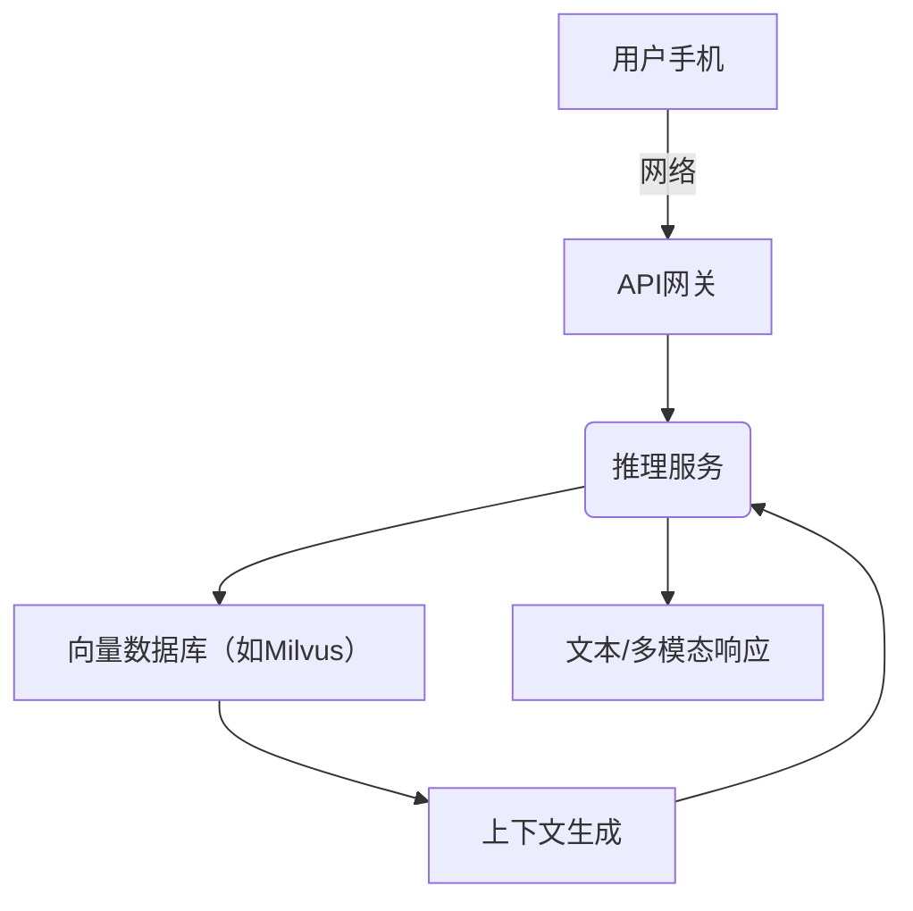

DeepSeek V3.x 模型内不包含外部记忆模块，主要依赖超大上下文窗口和内部权重储存知识。V3 系列的 MLA 技术将键值投影到低维空间减少缓存占用，这可视为一种内部临时记忆优化（属于计算优化范畴，而非语义记忆）。目前 DeepSeek 尚未提供持续学习或记忆更新机制，推理时全依赖训练得到的静态参数。近期公开论述中，多聚焦算力优化而非记忆管理（V4 预计才会加入 Engram 类模块）。

## 训练流程

DeepSeek V3 初版于2024年末发布，V3.1/V3.2 紧随其后。训练使用通用语料+代码数据集。与 Kimi 类似，预处理包括常规分词、可能的分布式单词表。Loss 为交叉熵，可能结合 RLHF 微调。优化器为 AdamW，混合精度训练以加速。由于运用稀疏专家，各层仅激活部分专家，显著降低训练成本。V3.x 采用了 256 个专家（72 专家版参考），模型激活参数约数十亿级。训练在大量 GPU 芯片（NVIDIA/Huawei）上进行，FLOPs 达百Z级。对比 Kimi，DeepSeek 更强调推理效率（kernel 优化、硬件兼容）。检查点由 DeepSeek 官方维护公开（CoreWeave等平台），模型权重常可通过 Bailian 协作平台获取。

## 系统架构与移动集成

DeepSeek 模型通常通过云服务提供，手机端可调小型版本或量化模型。对于闲聊场景，可在设备端运行小型（2-4B）衍生模型，并结合本地向量索引缓存历史（类似 OpenClaw 方案）；复杂计算委托云端。多端同步可通过 API 网关处理。对于可训练或调优情景，可利用 DeepSeek 的 API 细粒度控制（推理温度、顶k等）。以下示意了常见部署方式：

## 评估基准

DeepSeek V3/R1 在论文（及社区报告）中重点测评推理类任务（如数学、逻辑推理、代码）。应使用与 Kimi 类似的测试：MMLU、CMMLU、BBH、AGIEval、HumanEval 等，对比V3.x与其它模型。特殊之处在于 DeepSeek 注重长上下文效率，可引入 LongBench 或 RULER（测试跨文档依赖）等基准。另外，Idle latency（无工具调用简单对话）和 Token throughput 是重点监测指标。DeepSeek 官方表示 V3.2 改进了输入/输出成本，但具体指标未公开。

## 实验结果

公开资料显示 DeepSeek V3.2 相比 V3.1 在效能上有所提升（节省KV缓存、参数利用更优）。根据 CITIC 报告，V3.2 在成本效率上比 V3.1 降低了 60%/75%（输入/输出）。在推理任务上，V3.1 已被业界测试为竞争力较强（细节可参考社区对比评测）。Engram 整合前的 V3.x 预计在知识问答上略弱于后者；其主要优势在于利用稀疏结构加速计算。硬件吞吐方面，得益于 MLA，DeepSeek 在 GPU 内存要求上优于普通 Transformer，但延迟略高于无稀疏模型。具体精度数据和 ablation 暂无公开文献详细说明。

## 典型失败案例

DeepSeek 在需要超长依赖或非常规推理（例如新领域符号逻辑）可能出错，因为它的记忆依赖短期上下文。而且 MoE 路由可能导致少数词元激活错误专家，造成答非所问。DSA 等新机制也可能在微调/低资源平台（如移动端）上出现性能不稳定。作为假设：若 DeepSeek 仅在服务器运行，则典型问题包括实时性不足和对未见领域泛化弱；在多Agent或外部知识场景中，需辅助外部检索。

## 应用场景与示例

DeepSeek 模型适合科研、商业文档分析、代码辅助等领域。示例：法律文书问答、技术文档理解、多轮编程对话等。由于已开源模型权重，研究者常在 HuggingFace 或 Baidu 等平台进行自定义训练和测试。DeepSeek 社区也开发了配套的检索增强工具与下游任务代码库，便于集成到平台产品。

## 技术贡献与影响

DeepSeek 系列通过底层架构创新（MLA、DSA、MoE）显著提高了模型在相同资源下的推理效率。尤其是 KV 压缩技术，为长上下文提供了可行路径；最新的 Engram 计划则可能重塑记忆管理。指出，V4 将通过将 Engram 引入 DSA+MoE 架构来实现“指数级降低注意力计算”并开启超长记忆时代。DeepSeek 的进展推动了国产模型的效率竞赛，对比国际大厂，缩小了性能差距，并为可持续大模型研究提供了技术参考。

## **Engram** 记忆模型（采用经典创新记忆方式）

DeepSeek（梁文锋团队）发布的 **Engram** 模型引入了“条件记忆”模块，将大语言模型的静态知识检索与动态推理分离开来。Engram 模块在 Transformer 内部开辟了一个专用记忆空间，对固定短语和实体等知识进行哈希索引，实现了恒定时间 **O(1)** 的查询。该记忆空间不占用上下文窗口，也不增加推理计算量，且容量可近乎无限扩展。在等参数等计算（iso-FLOPs）条件下，Engram-27B 相比纯 MoE-27B 基线在知识问答、推理、代码和数学等任务上均有明显提升（如 MMLU 提升约3.0 分，BBH 提升5.0 分，长上下文问答 Needle-in-Haystack 准确率由84.2%升至97.0%）。同时，Engram 采用确定性地址预取，可将百亿级别的记忆参数表卸载至主机内存，只带来极小的吞吐量开销（约2.8%）。

官方论文链接：[https://ar5iv.labs.arxiv.org/html/2601.07372#:~:text=While%20Mixture,FLOPs%20MoE%20baseline](https://ar5iv.labs.arxiv.org/html/2601.07372#:~:text=While%20Mixture,FLOPs%20MoE%20baseline)

**Engram 模型**则开创性地将记忆机制“植入”到模型内部。Engram 作为 Transformer 的附加模块，引入了一个静态**N-gram 记忆表**，对常见的短语或事实进行编码（如将不同形式的“巴黎”归一化为同一标识）。其核心创新包括：

  - **压缩式分词 (Tokenizer Compression)**：对词元标准化处理（Unicode 分解、去重音、全小写等），将等价词元映射到同一 ID，大幅减少词汇表规模。例如，不同形式的“Paris”都被映射为同一个“巴黎”标识，从而减少约23%的词元量。
  - **多头哈希 (Multi-Head Hashing)**：直接存储所有可能 N-gram 是不可行的，Engram 对每个 N-gram 级别采用 $K$ 个独立的哈希头，将上下文映射到巨大的稀疏嵌入表索引。检索时会从每个哈希头获取嵌入并聚合，以降低单一哈希冲突的影响。
  - **上下文门控 (Context-Aware Gating)**：从 Engram 记忆检索到的嵌入会与当前模型隐状态做匹配，上下文不符合时门控器自动抑制噪声，否则放行正确信息。这一机制保证了只有与当前对话语境一致的事实才能影响推理。
  - **稀疏性分配律 (Sparsity Allocation Law)**：论文发现，在固定参数和 FLOPs 预算下，分配给条件计算（如 MoE 专家）与静态记忆（Engram）的参数之间存在 U 型最优分布。合理的分配比例（Engram 占比约75%-80%）可最大化模型效能。论文通过大规模训练验证：Engram-27B 模型与 iso-参数 MoE-27B 相比，在多模态评测中均有提升，证明了条件记忆的有效性。
  - **硬件协同设计 (System Efficiency)**：Engram 模块的地址计算是确定性的，因此可以进行异步预取。在推理时，百亿级的 Engram 嵌入表存储在主机 DRAM 中，系统在模型计算过程中并行将所需条目通过 PCIe 传送到 GPU。这使得 Engram 能够绕过 GPU 高带宽内存限制，扩展近乎无限的记忆容量。实验显示，即使离线迁移 1000 亿参数规模的嵌入表，推理开销也只增加约2.8%。

上图展示了 Engram 模块在 Transformer 中的集成方式：每隔数层引入一次条件记忆检索，与正常的自注意力和 MoE 分支并行，最后通过残差相加融合到主干中。通过这种方式，模型可以显式查询事实性知识，而无需在每次推理时反复重建这些知识。

## **技术路线与训练流程**

### **模型架构**

Engram 模型基于带有混合专家（MoE）分支的稀疏 Transformer。DeepSeek V3.2 版本已经采用了稀疏注意力（DSA）+MoE 架构以提高效率和降本。在此基础上将 Engram 条件记忆融入该架构：构建一个**多层级存储**，将热知识存储在高速嵌入表（部分驻留 GPU HBM），冷门知识存储在主机 DRAM。

> Engram-27B 架构在传统 Transformer 模型（相当于 26.7B 参数的 MoE-27B 基线）中，减少专家（MoE）的数量，将释放的 ~5.7B 参数用于构建 Engram 嵌入表。论文实验中，Engram-27B 架构为“2+55专家（Top-6 路由） + 5.7B Engram”，而基线 MoE-27B 为“2+72专家（Top-6）”。这意味着 DeepSeek 将部分专家容量转向 Engram 嵌入参数，从而在相同总参数下实现记忆增强。未来的 Engram-40B 则使用 2+55 专家加 18.5B 的 Engram 参数。

### **数据与预处理**

训练数据主要是大规模通用文本语料（数百亿至万亿级 Token）。Engram 模型对输入文本首先进行与常规 Transformer 相同的分词与位置编码，同时对同根词、同义词等进行归一化处理（遵循论文的 tokenizer compression 步骤）。在训练时，模型同时学习 Transformer 的参数和 Engram 嵌入表参数。由于 Engram 嵌入表规模巨大，训练阶段采用模型并行：嵌入表切分到多块 GPU，同时利用 All-reduce/All-to-All 原语通信获取当前批次需要的嵌入行。

### **优化与超参**
