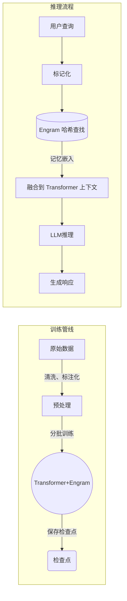

论文中Engram模型训练采用与基线 MoE 相同的超参和优化策略（如大规模学习率预热、分层学习率调度、AdamW 优化等）。Engram 特有的超参包括哈希头数量 K、不同 N-gram 的表大小等，这些值需在充分实验后设定。DeepSeek 团队也开放了包含演示的代码（`engram_demo_v1.py`），可供复现核心逻辑。在 DeepSeek-V3 系列中，由于降低成本是重要目标（输入输出 Token 成本分别下降了60%/75%），训练可能采用了混合精度、梯度累积等工程技术来提高效率。

### **算力与检查点**

Engram-27B 规模参数量与 MoE-27B 相近（有效激活参数约 3.8B），但嵌入表体量更大（数十亿参数）。训练时使用顶级 AI 计算设施（如数百张A100/H100 GPU集群）并行处理数千亿级 Token。DeepSeek 已公开论文和代码，但截至目前尚未公布完整检查点。论文中提到在 26年1月发布的 V3.2 用稀疏架构训练，V4 可能于4月发布。

### **持续学习/记忆机制**

Engram 本身提供“无限记忆”能力；一旦嵌入表训练完毕，其静态知识可以随时查询。理论上新知识需要通过在线训练或后续 Fine-tune 更新嵌入表，当前方案仍主要依赖预训练获取静态记忆。与 OpenClaw 的外部记忆方案不同，Engram 将学习到的记忆嵌入内置于模型中，模型本身“懂得”该记忆，而不是像插件一样引用外部笔记。此外，Engram 模块也可以与混合专家同步更新，使得模型在持续使用过程中具备“自成长”能力（如 DeepSeek 创始人所言，一旦该架构落地，模型就可像人一样记忆经验和个性化偏好）。

## **系统架构与移动集成**

在**移动端助手**场景下，系统需兼顾响应速度和记忆能力。以下示意给出了两种架构流程：

  - **闲聊场景（低延时）**：此时响应时间要求严格（目标<100ms）。最佳做法是使用较小的本地模型，搭配轻量记忆机制（如 OpenClaw 的本地 Markdown+向量搜索）。在此场景下，一般不会完整加载大规模 Engram 模型，而是采用近似方案：例如预先离线检索重要记忆并注入上下文，或使用局部小型记忆表。需要权衡的点包括：记忆召回的粒度（更细致记忆增加消耗）、模型容量（大模型推理慢）与离线检索召回（可能带网络/API时延）。一个可行策略是限制向量检索结果数目，并将 Memory 缓存于本地硬件（如手机闪存）中，避免频繁网络请求。具体目标延时预算可设为**50ms~150ms**（移动设备视算力而定），任何添加到对话窗口的记忆都要在此延时预算内检索完成；超出延时则需牺牲召回召准确度或记忆规模。
  - **深度研究场景（高容忍度）**：在此模式下，可允许更长的延迟（最高可达数分钟）。系统可以使用更大的 Engram 模型或云端服务器，充分利用 Engram 的离线检索优势。例如在查询启动时并行执行复杂检索，异步将大量相关文档或知识查找到设备，再逐步交给模型处理。可容忍 1-10 分钟检索/处理时间，以换取更完整的答案和分析。这适合学术问答、资料整理等场景，可以充分发挥 Engram 的超长上下文和离线数据库能力。推荐建立可复用的检索管线：先对常见查询通过 Engram 快速定位事实，以便将结果缓存，后续深层分析再投入更多计算。此时可设定较宽松的**延时预算 ~1-2min**用于关键查询，甚至异步返回结果。

在两种场景下，系统都需监控内存占用和吞吐（mobile 资源有限）。可根据终端设备算力（GPU/CPU）灵活调整 Engram 模型大小与检索策略，例如闲聊模式下关闭离线预取，仅使用本地小规模记忆；研究模式下开启大容量 Engram 检索并借助云计算。总体而言，应最大化利用 Engram 的异步预取特性（在输入到达时就提前查表），并在设备上保持较小的上下文窗口，以确保低延时不被大量上下文推理拖慢。

## **评估方法与基准测试**

### **评估任务**

Engram 模型在论文中使用了广泛的评测基准，包括知识问答（MMLU、CMMLU）、通用推理（BBH、ARC-Challenge、AGIEval）、编程（HumanEval、MBPP）和数学推理（GSM8K、MATH）任务。特别地，在**长上下文检索**方面，使用了针扎稻草堆（Needle-in-a-Haystack，NIAH）等测试，Engram 将查找准确率从84.2%提升到97.0%。对于移动场景，还应考虑响应时延、吞吐量（tokens/s）等指标。在**闲聊场景**下，可参考如 ClawEval、T2-Bench 等测评代理调用和对话连贯性的指标；在**深度研究场景**下，可使用事实检索质量指标（如查准率、查全率）以及文献问答数据集（E2E QA、MMLU-专业版等）。

### **评测协议**

建议设计可复现的协议，包含离线测试和在线模拟。离线测试时，使用标准数据集评估准确率和延迟，如论文所用的各类基准；可额外构造具有超长上下文的问答场景（文档长度上万字符），比较 Engram 和 MoE 在不同文档长度下的正确率和查询时间。对于在线评测，可以模拟实际对话流程，将缓存检索时间计入，衡量系统整体响应时间和质量。对比基线包括：无记忆的纯 Transformer、传统 RAG 系统（如检索到内存后填入 prompt）和其他记忆模型（见下文表格）。

### **延时敏感 vs 容忍**

在低延时基准中，对应闲聊场景，应设置严格的延时上限（如100ms 内返回 128-token 回答），并测量在这一约束下的准确率或用户满意度；在高容忍度评测中，可放宽至数分钟，重点考察记忆召回的完整性和知识检索覆盖率。

## **实验结果与性能指标**

DeepSeek 在论文中给出了与 MoE 基线的详细对比。在严格的 **iso-参数/iso-FLOPs** 条件下，Engram-27B 在多项任务上均取得领先：如 MMLU 从57.4提升至60.4（+3.0）、BBH 从50.9到55.9（+5.0）。在编程和数学测试中也有类似提升（HumanEval +3.0，MATH +2.4）。长上下文 NIAH 测试显示 Engram-27B 达到97.0%的准确率，而 MoE-27B 仅为84.2%。综合来看，Engram 在**知识回忆**与**推理深度**上都优于传统 MoE 模型。

这些结论可归纳如下表（以部分关键任务为例）：

| **任务** | **MoE-27B 准确率** | **Engram-27B 准确率** | **提升** |
| --- | --- | --- | --- |
| MMLU（多学科） | 57.4% | 60.4% | +3.0 |
| BBH（逻辑推理） | 50.9% | 55.9% | +5.0 |
| ARC-Challenge | 70.1% | 73.8% | +3.7 |
| HumanEval（编程） | 37.8% | 40.8% | +3.0 |
| GSM8K（数学） | 58.4% | 60.6% | +2.2 |
| NIAH（长检索） | 84.2% | 97.0% | +12.8 |

此外，在 **推理延迟和吞吐量**方面，Arxiv 实验表明离线迁移嵌入表对整体吞吐影响极小：8B 规模 Engram 层将 100B 级别嵌入表卸载到主机内存，吞吐下降仅约2.8%。这说明 Engram 通过异步预取可以在几乎不增加响应时间的情况下扩展记忆。Engram 模块的**内存占用**主要来自静态嵌入表，其峰值约为几十GB（视模型规模而定），相较普通模型需要额外的主机 RAM 资源。

### **消融研究**

论文通过不同 sparsity 分配比和 Embedding 大小的实验（参见 Sparsity Allocation 图）验证了 Engram 的有效性。可以进一步观察，例如关闭上下文门控或减少哈希头数会造成知识检索的准确率下降。典型失败案例包括：极端罕见的短语未在 Engram 表中存在时无法检索；哈希冲突可能导致错误记忆被检出（尽管多头哈希能减缓此类问题）；门控机制在上下文强烈矛盾时可能错误抑制正确记忆。此外，Engram 依赖预先编码的“静态”知识，对于输入中出现的完全新颖事实（预训练未覆盖）无能为力。这些场景下模型只得通过剩余的 Transformer 层来推断，可能导致出错。

# OpenClaw

**OpenClaw 平台** 是一种开源的智能代理框架，强调“记忆与人格”能力。

OpenClaw 智能体默认是无状态的。每次对话都从零开始——你的智能体完全不知道用户昨天说了什么，表达了什么偏好，或者三个会话前讨论过什么。对于代码助手或一次性任务运行器来说，这没问题。但如果你构建的是一个更像长期合作者的工具——比如私人助理、研究伙伴或了解你项目历史的顾问——那么无状态性就成了致命缺陷。

OpenClaw 通过[**内存插件**](https://docs.openclaw.ai/tools/plugin#memory-plugins)解决了这个问题：这些插件是可随时添加的后端，能够跨会话持久化和检索信息。代理程序会实时存储记忆，当出现依赖于过去信息的问题时，插件会自动提取相关的记忆块。但是，不同的内存插件在检索方式上差异很大。默认方式是基于 SQLite 的索引（`memory-core`），但本文将展示如何使用[**LanceDB**](https://github.com/lancedb/lancedb)来获得更好的结果。

> **记忆系统**将长期记忆以 Markdown 文本文件形式存储在本地（如 `MEMORY.md` 保存用户偏好等重要事实，`YYYY-MM-DD.md` 保存每日会话笔记），通过外部嵌入式搜索工具（SQLite+向量检索）进行查询。
