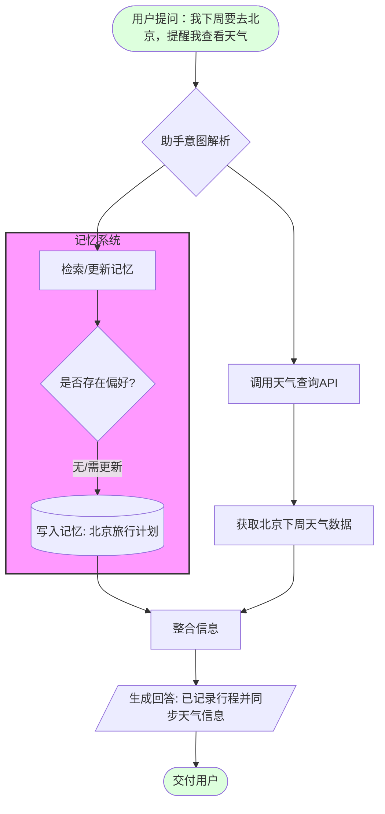
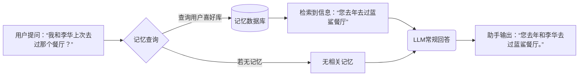

- **交互设计**：通过对话UI和视觉界面明确“记忆”功能。例如，在对话界面提示助手已记住哪些内容（如“已记住您喜欢的咖啡”），并在设置中可查看/清理记忆。设计应允许用户主动标注要记或不记的信息（参见OpenAI的交互开关。此外，对话中可加入主动提示：“我已经记住了，是否写入您的个人档案？”避免用户感知不到后台变化。
- **记忆管理策略**：可区分**长期记忆**与**短期记忆**：短期记忆仅限单会话内（如对话缓存），会话结束后释放；长期记忆则写入用户档案（如个人偏好、个人资料、待办事项等）。对长期记忆引入淘汰策略（如最近最少使用或基于价值）避免记忆库膨胀。对于分类明确的信息（姓名、爱好），使用键值或知识图谱索引；对模糊事件（日程、文档内容），则采用语义向量存储。记忆检索时，可先使用知识图谱定位精确信息，再用向量搜索查找相关补充，提高速度与准确度。对于手机助手，推荐按场景标签存储记忆并允许用户分组查看。对于短期任务，可指定会话结束后将上下文转化为记忆并保存，或在一段时间后过期。使用LRU（最近最少使用）或过时淘汰策略清理旧记忆。
- **隐私提示**：在敏感信息写入记忆前，应明确告知用户。例如“您刚分享的行程信息将保存在记忆中，方便以后查询，如您不同意可选择不保存”。并提供管理入口让用户随时查看和删除记忆。对个人数据应采用本地存储或分级同态加密方式保存（如华为提到的多层缓存），避免明文保存服务器。默认情况下关闭或限制记忆访问敏感数据。
- **缓存与优化**：手机助手可设计本地缓存与云同步机制：对于常用记忆（如联系人、收藏的地点等）保存在设备上，提高离线可用性；新记忆临时缓存（保持几天）后再同步至云端数据库，减少频繁网络交互。可使用轻量级模型（如LFM2）在设备端快速响应简单查询，复杂查询或大上下文时再调用云端大模型。代理层应对记忆查询做智能路由：先尝试本地索引或缓存，再退回云端。
- **冷启动与跨设备同步**：初次使用助手时，可通过问答帮助建立记忆基础（如基础偏好、常用联系人）。例如通过引导对话：“您好！为更好服务，请告诉我几个常去的地点或喜好。”然后把这些答案存入记忆库。还可以让用户导入旧设备的记忆（同步账号数据）。新设备加入时，通过用户账号恢复记忆：可先请求云端记忆摘要，并将个性化信息下载到本地。设计跨设备同步协议（类似RynnRCP）保证当一个设备更新记忆时，其他设备也获取更新。对于冷启动的用户，可用基础偏好模板（如问答形式）初始化个人资料。

下图示例对话与记忆管理流程，说明了用户信息提取、存储和检索的基本逻辑：

流程说明：用户说出旅行计划时，系统先尝试从记忆库检索是否已有相关信息（C）。如果是首次提及，则将该旅行计划**新增**到个人记忆（D）。随后助手调用天气服务（F），并将结果一并回复（G）。对话完成后，用户记忆中已包含“下周去北京”这一事件，未来助手可主动提醒或关联其他任务。

**示例对话**：

- 用户：_“明天我有什么日程安排？”_
- 助手（检索日历记忆）：_“您明天上午10点有会议。”_（利用日历记忆）
- 用户：_“好，帮我提醒李华会议改到后天。”_
- 助手（更新记忆后执行）：_“已将李华会议改到后天上午10点，并提醒您。”_

# 结论与未来展望

2026年Q1各大厂商的闲聊大模型均开始重视“记忆”能力，将其作为提升对话智能和用户体验的关键功能。总体趋势是：从原先仅依赖上下文窗口，到引入外部记忆存储；从被动回答转向主动服务。各家实现方式多样，有的采用知识库+检索的外部存储（Anthropic、阿里Polar Memory），有的依赖模型自身的架构能力（Meta长上下文、RynnBrain时空记忆），也有混合本地与云端方案（MiniCPM端侧感知、豆包的系统级存储）。

对于手机助手，记忆功能可以让对话更加**连续、个性化和高效**，但也带来了存储、隐私和同步的工程挑战。未来研究可聚焦**更高效的记忆存储结构**（如动态索引、多模态记忆融合）、**智能记忆压缩**技术，以及**隐私保护机制**（如基于联邦学习的个性化模型）。此外，交互研究也很重要，需设计出用户易于理解和操作的记忆管理界面。随着技术进步，全面评估记忆对对话质量的影响及优化方案将成为下一阶段热点。

## 补充一些技术博客或者论文：

1.arXiv:2510.27246（分层情境记忆 (LIGHT)）

提出了 BEAM 基准和 LIGHT 记忆框架，详细描述了如何通过三级存储显著提升长周期对话质量。将记忆分为：**工作记忆**（当前对话）、**情节记忆**（过去发生的事件）和**知识草稿**（总结出的事实）。

优点：模拟人类认知，逻辑极强，能记住几周前的细节。

缺点：推理开销较大，需要复杂的动态调度。

2.[Efficient Infinite Context Transformers](https://www.promptingguide.ai/research/infini-attention)状态压缩机制：Infini-attention

通过在 Transformer 的注意力层中集成“压缩记忆单元”，使模型能处理**无限长度**的输入。它将旧信息转化为固定的线性状态，推理开销不再随长度线性增长。解决了手机助手因内存（RAM）不足导致无法保存长历史的痛点。

3.[OpenReview PDF (DT7JyQC3MR)](https://openreview.net/pdf?id=DT7JyQC3MR)交互式记忆评估：MemoryAgentBench

提出了四项核心能力指标：**精确检索、测试时学习、长程理解、选择性遗忘**。报告详细对比了 RAG 方案与 Agentic 方案（如 MemGPT）在真实交互中的优劣。

4.[https://arxiv.org/abs/2602.12116](https://arxiv.org/abs/2602.12116)P-GenRM：基于测试时用户的个性化生成式奖励模型

基于用户缩放功能的个性化生成式奖励模型。P-GenRM 将偏好信号转换为结构化的评估链，从而在各种场景下生成自适应的用户画像和评分标准。它进一步将用户聚类为用户原型，并引入双粒度缩放机制：在个体层面，它自适应地缩放和聚合每个用户的评分方案；在原型层面，它整合了类似用户的偏好。

### 厂商发布网址

#### OpenAI:[https://openai.com/research/index/release/](https://openai.com/research/index/release/)

    **目前动态：**2026年3月推出了 **GPT-5.3 Instant**（日常对话优化）及 **GPT-5.3 Codex-Spark**（实时代码 Agent）。

    **中文实测**：在处理复杂的**中文语用暗示**（如“听话听音”）方面，GPT-5.3 表现出了极强的逻辑稳定性，其 API 的长上下文召回率（Recall）几乎不随 Token 增加而衰减。

#### Anthropic:[https://platform.claude.com/docs/en/release-notes/overview](https://platform.claude.com/docs/en/release-notes/overview)

    **目前动态：**2026年2月上线了 **Compaction API**（测试版），支持对长对话进行服务器端的自动摘要压缩。

    **中文实测**：Claude 在中文学术写作和**多轮逻辑纠错**上依然领先。其“长线思考”（Extended Thinking）模式能有效避免在超长对话中出现前后矛盾。

#### **Google: **[Gemini 3 Technical Guide](https://ai.google.dev/gemini-api/docs/gemini-3?hl=zh-cn)

    **目前动态**：2026年3月 9 日正式迭代至 Gemini 3.1 Pro。

    **中文实测**：作为原生多模态模型，它在处理中文文档扫描件（OCR+记忆）时效果最佳，能记住 100+ 页 PDF 中的微小细节并与当前会话关联。

#### **月之暗面 (Moonshot AI): **[Moonshot AI Blog](https://www.google.com/search?q=https://www.moonshot.cn/blog)

    **中文实测**：Kimi-3 在 Q1 强化了“动态长程搜索”。在处理 20 万字以上的中文小说或行业研报时，其语义理解的细腻程度优于 GPT-5.3，特别是在中国法律条文的交叉引用上。